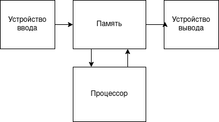
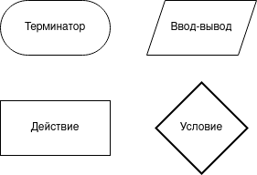
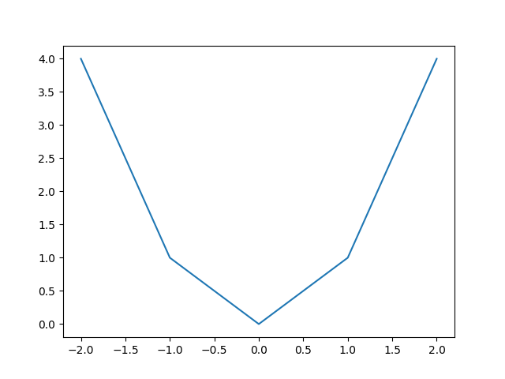
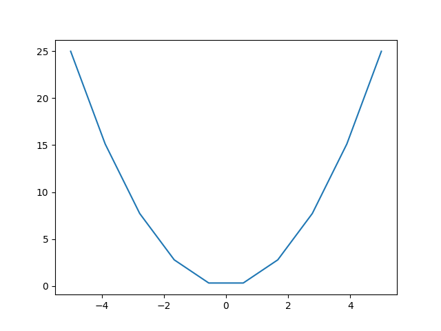
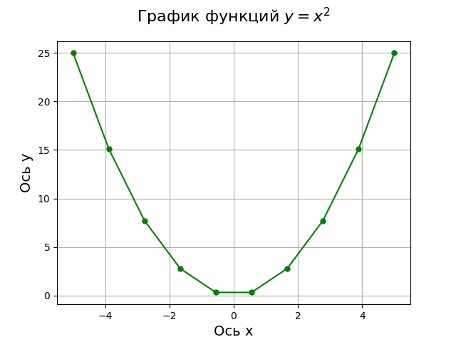
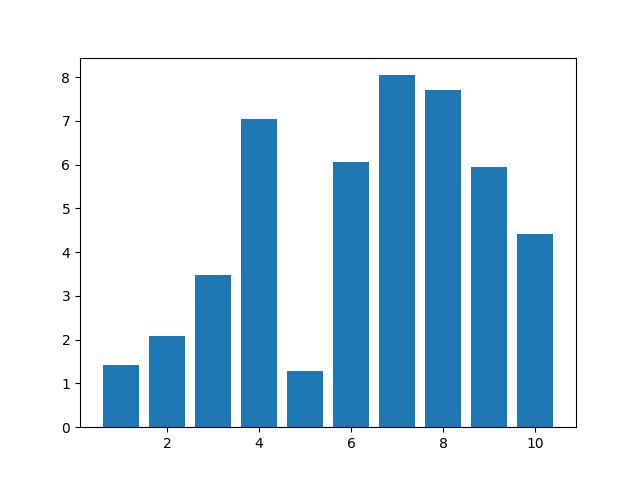
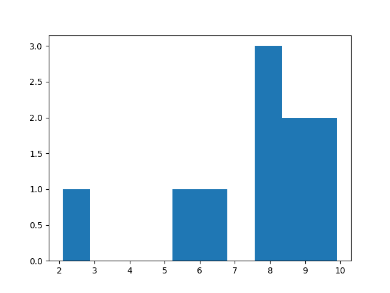
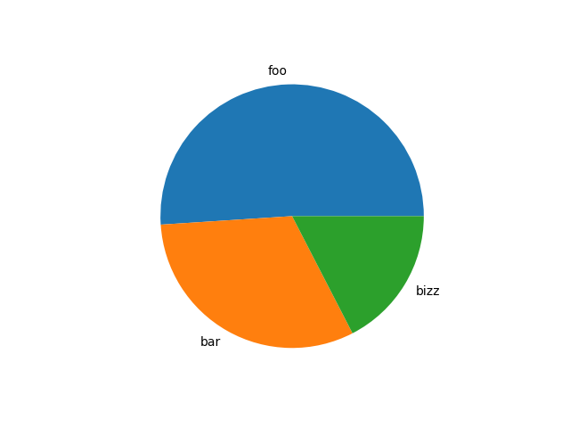

# Программирование. Подготовка к экзамену

## От автора

Куда скидывать найденные очепятки и печенюшки Вы, думаю, уже знаете:
- [t.me/zhikhkirill](https://t.me/zhikhkirill)
- [vk.com/zhikh.localhost](https://vk.com/zhikh.localhost)
- [github.com/zhikh23](https://github.com/zhikh23)

## Теоретические вопросы

- [Программирование. Подготовка к экзамену](#программирование-подготовка-к-экзамену)
  - [От автора](#от-автора)
  - [Теоретические вопросы](#теоретические-вопросы)
    - [1. Электронная вычислительная машина. Устройство ЭВМ. Программа. Исходный текст, исполняемый файл](#1-электронная-вычислительная-машина-устройство-эвм-программа-исходный-текст-исполняемый-файл)
      - [ЭВМ](#эвм)
      - [Устройство ЭВМ](#устройство-эвм)
      - [Программа и исходный текст](#программа-и-исходный-текст)
    - [2. Схемы алгоритмов](#2-схемы-алгоритмов)
      - [Нестрогое определение](#нестрогое-определение)
      - [Основные блоки](#основные-блоки)
    - [3. Языки программирования. Классификация](#3-языки-программирования-классификация)
      - [Язык программирования. Определение](#язык-программирования-определение)
      - [Классификация](#классификация)
    - [4. Язык Python. Структура программы. Лексемы языка](#4-язык-python-структура-программы-лексемы-языка)
      - [Язык программирования Python](#язык-программирования-python)
      - [Структура программы](#структура-программы)
      - [Лексемы языка Python](#лексемы-языка-python)
    - [5. Типы данных языка Python. Классификация. Скалярные типы данных. Приведение типов](#5-типы-данных-языка-python-классификация-скалярные-типы-данных-приведение-типов)
      - [Типы данных](#типы-данных)
      - [Классификация](#классификация-1)
      - [Типы данных](#типы-данных-1)
      - [Приведение типов](#приведение-типов)
    - [6. Операции над скалярными типами данных. Приоритеты операций](#6-операции-над-скалярными-типами-данных-приоритеты-операций)
      - [Над числами](#над-числами)
      - [Над логическими значениями](#над-логическими-значениями)
      - [Приоритеты операций](#приоритеты-операций)
    - [7. Функции ввода и вывода. Ввод данных](#7-функции-ввода-и-вывода-ввод-данных)
      - [Ввод](#ввод)
      - [Вывод](#вывод)
    - [8. Функции ввода и вывода. Функция вывода. Форматирование вывода](#8-функции-ввода-и-вывода-функция-вывода-форматирование-вывода)
      - [Форматирование вывода](#форматирование-вывода)
    - [9. Оператор присваивания. Множественное присваивание](#9-оператор-присваивания-множественное-присваивание)
      - [Оператор присваивания](#оператор-присваивания)
      - [Множественное присваивание](#множественное-присваивание)
      - [Комбинированное присваивание](#комбинированное-присваивание)
      - [Присваивание внутри выражения](#присваивание-внутри-выражения)
    - [10. Условный оператор. Полные условные операторы. Неполные условные операторы. Тернарный оператор условия. Примеры использования](#10-условный-оператор-полные-условные-операторы-неполные-условные-операторы-тернарный-оператор-условия-примеры-использования)
      - [Полный условный оператор](#полный-условный-оператор)
      - [Неполный условный оператор. Пример](#неполный-условный-оператор-пример)
      - [Тернарный оператор](#тернарный-оператор)
    - [11. Условные операторы. Множественный выбор. Вложенные операторы условия. Примеры использования](#11-условные-операторы-множественный-выбор-вложенные-операторы-условия-примеры-использования)
      - [Множественный выбор. Пример](#множественный-выбор-пример)
      - [Вложенные операторы условия. Пример](#вложенные-операторы-условия-пример)
    - [12. Операторы цикла. Цикл с условием. Операторы break и continue. Примеры использования](#12-операторы-цикла-цикл-с-условием-операторы-break-и-continue-примеры-использования)
      - [Цикл. Определение](#цикл-определение)
      - [Операторы цикла в Python](#операторы-цикла-в-python)
      - [Цикл с условием](#цикл-с-условием)
      - [Операторы break и continue](#операторы-break-и-continue)
    - [13. Операторы цикла. Цикл с итератором. Функция range(). Примеры использования](#13-операторы-цикла-цикл-с-итератором-функция-range-примеры-использования)
      - [Цикл. Определение](#цикл-определение-1)
      - [Операторы цикла в Python](#операторы-цикла-в-python-1)
      - [Цикл с итератором](#цикл-с-итератором)
      - [Функция range()](#функция-range)
    - [14. Изменяемые и неизменяемые типы данных](#14-изменяемые-и-неизменяемые-типы-данных)
    - [15. Списки. Основные функции, методы, операторы для работы со списками](#15-списки-основные-функции-методы-операторы-для-работы-со-списками)
      - [Список](#список)
      - [Основные функции](#основные-функции)
      - [Основные методы](#основные-методы)
      - [Операторы](#операторы)
    - [16. Списки. Создание списков. Списковые включения](#16-списки-создание-списков-списковые-включения)
      - [Списки](#списки)
      - [Списковые включения](#списковые-включения)
      - [Создание списков](#создание-списков)
    - [17. Списки. Основные методы для работы с элементами списка. Добавление элемента, вставка, удаление, поиск](#17-списки-основные-методы-для-работы-с-элементами-списка-добавление-элемента-вставка-удаление-поиск)
      - [Списки](#списки-1)
      - [Основные методы для работы с элементами списка](#основные-методы-для-работы-с-элементами-списка)
      - [Добавление, вставка, удаление и поиск элемента](#добавление-вставка-удаление-и-поиск-элемента)
    - [18. Списки. Основные операции со списками. Поиск минимального элемента. Поиск максимального элемента. Нахождение количества элементов. Нахождение суммы и произведения элементов](#18-списки-основные-операции-со-списками-поиск-минимального-элемента-поиск-максимального-элемента-нахождение-количества-элементов-нахождение-суммы-и-произведения-элементов)
      - [Списки](#списки-2)
      - [Основные операции со списками](#основные-операции-со-списками)
      - [Поиск минимального или максимального элемента](#поиск-минимального-или-максимального-элемента)
      - [Нахождение количества элементов](#нахождение-количества-элементов)
      - [Сумма и произведение элементов](#сумма-и-произведение-элементов)
    - [19. Списки. Использование срезов при обработке списков](#19-списки-использование-срезов-при-обработке-списков)
      - [Списки](#списки-3)
      - [Использование срезов](#использование-срезов)
    - [20. Кортежи. Основные функции, методы, операторы для работы с кортежами](#20-кортежи-основные-функции-методы-операторы-для-работы-с-кортежами)
      - [Кортежи](#кортежи)
      - [Функции, методы, операторы](#функции-методы-операторы)
    - [21. Словари. Понятие ключей и значений. Создание словарей. Основные функции, методы, операторы для работы со словарями](#21-словари-понятие-ключей-и-значений-создание-словарей-основные-функции-методы-операторы-для-работы-со-словарями)
      - [Словари](#словари)
      - [Понятие ключей и значений](#понятие-ключей-и-значений)
      - [Создание словарей](#создание-словарей)
      - [Основные операторы, функции и методы](#основные-операторы-функции-и-методы)
    - [22. Множества. Основные функции, методы, операторы для работы с множествами](#22-множества-основные-функции-методы-операторы-для-работы-с-множествами)
      - [Множества](#множества)
      - [Основные функции, методы и операторы](#основные-функции-методы-и-операторы)
    - [23. Строки. Основные функции, методы, операторы для работы со строками. Срезы](#23-строки-основные-функции-методы-операторы-для-работы-со-строками-срезы)
      - [Строка](#строка)
      - [Основные функции, методы, операторы](#основные-функции-методы-операторы)
      - [Срезы](#срезы)
    - [24. Матрицы. Создание матрицы. Ввод и вывод матрицы. Выполнение операций с элементами матрицы](#24-матрицы-создание-матрицы-ввод-и-вывод-матрицы-выполнение-операций-с-элементами-матрицы)
      - [Матрицы](#матрицы)
      - [Создание](#создание)
      - [Операции с матрицами](#операции-с-матрицами)
    - [25. Матрицы. Квадратные матрицы. Обработка верхне- и нижнетреугольных матриц. Работа с диагональными элементами матрицы](#25-матрицы-квадратные-матрицы-обработка-верхне--и-нижнетреугольных-матриц-работа-с-диагональными-элементами-матрицы)
      - [Матрицы](#матрицы-1)
      - [Обработка диагоналей](#обработка-диагоналей)
      - [Обработка треугольных матриц](#обработка-треугольных-матриц)
    - [26. Отладка программы. Способы отладки](#26-отладка-программы-способы-отладки)
    - [27. Подпрограммы. Функции. Создание функции. Аргументы функции. Возвращаемое значение](#27-подпрограммы-функции-создание-функции-аргументы-функции-возвращаемое-значение)
      - [Подпрограмма](#подпрограмма)
      - [Функции](#функции)
      - [Аргументы функции](#аргументы-функции)
    - [28. Функции. Области видимости](#28-функции-области-видимости)
      - [Функции](#функции-1)
      - [Области видимости](#области-видимости)
    - [29. Функции. Завершение работы функции. Рекурсивные функции. Прямая и косвенная рекурсия](#29-функции-завершение-работы-функции-рекурсивные-функции-прямая-и-косвенная-рекурсия)
      - [Функции](#функции-2)
      - [Завершение работы функции](#завершение-работы-функции)
      - [Прямые, косвенные рекурсивные функции](#прямые-косвенные-рекурсивные-функции)
    - [30. Функции высшего порядка. Замыкания](#30-функции-высшего-порядка-замыкания)
      - [Функции высшего порядка](#функции-высшего-порядка)
      - [Замыкания](#замыкания)
    - [31. lambda-функции](#31-lambda-функции)
    - [32. Аннотации](#32-аннотации)
    - [33. Функции map, filter, reduce, zip](#33-функции-map-filter-reduce-zip)
      - [Функция `map`](#функция-map)
      - [Функция `filter`](#функция-filter)
      - [Функция `reduce`](#функция-reduce)
      - [Функция `zip`](#функция-zip)
    - [34. Декораторы](#34-декораторы)
    - [35. Знак `_`. Варианты использования](#35-знак-_-варианты-использования)
    - [36. Модули. Способы подключения](#36-модули-способы-подключения)
      - [Модули](#модули)
      - [Способы подключения](#способы-подключения)
    - [37. Модуль math. Основные функции модуля. Примеры использования функций](#37-модуль-math-основные-функции-модуля-примеры-использования-функций)
      - [Переменные](#переменные)
      - [Функции](#функции-3)
    - [38. Модуль time](#38-модуль-time)
    - [39. Модуль random. Работа со случайными числами](#39-модуль-random-работа-со-случайными-числами)
    - [40. Модуль copy. Способы копирования объектов различных типов. "Глубокая" и "мелкая" копии](#40-модуль-copy-способы-копирования-объектов-различных-типов-глубокая-и-мелкая-копии)
      - [Модуль copy и способы копирования объектов](#модуль-copy-и-способы-копирования-объектов)
      - [Глубокая и мелкая копия](#глубокая-и-мелкая-копия)
    - [41. Объектно-ориентированное программирование. Основные понятия ООП](#41-объектно-ориентированное-программирование-основные-понятия-ооп)
      - [ООП](#ооп)
      - [Основные понятия ООП](#основные-понятия-ооп)
      - [Принципы ООП](#принципы-ооп)
    - [42. Исключения](#42-исключения)
    - [43. Файлы. Программная обработка файлов. Понятие дескриптора. Виды файлов](#43-файлы-программная-обработка-файлов-понятие-дескриптора-виды-файлов)
      - [Файл](#файл)
      - [Программная обработка файла](#программная-обработка-файла)
      - [Понятие дескриптора](#понятие-дескриптора)
      - [Виды файлов](#виды-файлов)
    - [44. Файлы. Режимы доступа к файлам](#44-файлы-режимы-доступа-к-файлам)
      - [Файл](#файл-1)
      - [Режимы доступа к файлам](#режимы-доступа-к-файлам)
    - [45. Файлы. Текстовые файлы. Основные методы для работы](#45-файлы-текстовые-файлы-основные-методы-для-работы)
      - [Файл](#файл-2)
      - [Текстовые файлы](#текстовые-файлы)
      - [Открытие текстового файла](#открытие-текстового-файла)
      - [Методы работы с текстовыми файлами](#методы-работы-с-текстовыми-файлами)
    - [46. Файлы. Текстовые файлы. Чтение файла. Запись в файл. Поиск в файле](#46-файлы-текстовые-файлы-чтение-файла-запись-в-файл-поиск-в-файле)
      - [Файл](#файл-3)
      - [Текстовые файлы](#текстовые-файлы-1)
      - [Чтение текстового файла](#чтение-текстового-файла)
      - [Запись в текстовый файл](#запись-в-текстовый-файл)
      - [Поиск в файле](#поиск-в-файле)
    - [47. Файлы. Текстовые файлы. Итерационное чтение содержимого файла](#47-файлы-текстовые-файлы-итерационное-чтение-содержимого-файла)
      - [Файл](#файл-4)
      - [Текстовые файлы](#текстовые-файлы-2)
      - [Итерационное чтение файла](#итерационное-чтение-файла)
    - [48. Файлы. Бинарные файлы. Основные методы. Сериализация данных](#48-файлы-бинарные-файлы-основные-методы-сериализация-данных)
      - [Файл](#файл-5)
      - [Бинарный файл](#бинарный-файл)
      - [Открытие бинарного файла](#открытие-бинарного-файла)
      - [Методы бинарных файлов](#методы-бинарных-файлов)
      - [Сериализация данных](#сериализация-данных)
    - [49. Файлы. Оператор with. Исключения при работе с файлами](#49-файлы-оператор-with-исключения-при-работе-с-файлами)
      - [Файл](#файл-6)
      - [Оператор with](#оператор-with)
      - [Исключение при работе с файлами](#исключение-при-работе-с-файлами)
    - [50. Типы данных bytes и bytearray. Байтовые строки. Конвертация различных типов в байтовые строки и обратно](#50-типы-данных-bytes-и-bytearray-байтовые-строки-конвертация-различных-типов-в-байтовые-строки-и-обратно)
      - [Типы данных bytes и bytearray, байтовые строки](#типы-данных-bytes-и-bytearray-байтовые-строки)
      - [Конвертация в байты и обратно](#конвертация-в-байты-и-обратно)
    - [51. Модуль struct](#51-модуль-struct)
    - [52. Модуль os. Основные функции\`](#52-модуль-os-основные-функции)
      - [Модуль os](#модуль-os)
      - [Основные функции](#основные-функции-1)
    - [53. \*Генераторы](#53-генераторы)
    - [54. Модуль numpy. Обработка массивов с использованием данного модуля. Работа с числами и вычислениями](#54-модуль-numpy-обработка-массивов-с-использованием-данного-модуля-работа-с-числами-и-вычислениями)
      - [Модуль `numpy`](#модуль-numpy)
      - [Создание массивов](#создание-массивов)
      - [Действия с массивами](#действия-с-массивами)
      - [Работа с числами](#работа-с-числами)
    - [55. Модуль matplotlib. Построение графиков в декартовой системе координат. Управление областью рисования](#55-модуль-matplotlib-построение-графиков-в-декартовой-системе-координат-управление-областью-рисования)
      - [Модуль matplotlib](#модуль-matplotlib)
      - [Построение графиков в декартовой системе координат](#построение-графиков-в-декартовой-системе-координат)
      - [Управление областью рисования](#управление-областью-рисования)
    - [56. Модуль matplotlib. Построение гистограмм и круговых диаграмм](#56-модуль-matplotlib-построение-гистограмм-и-круговых-диаграмм)
      - [Модуль matplotlib](#модуль-matplotlib-1)
      - [Построение гистограмм и круговых диаграмм](#построение-гистограмм-и-круговых-диаграмм)
    - [57. Списки. Сортировка. Сортировка вставками. Сортировка выбором](#57-списки-сортировка-сортировка-вставками-сортировка-выбором)
      - [Списки](#списки-4)
      - [Сортировка вставками](#сортировка-вставками)
      - [Сортировка выбором](#сортировка-выбором)
    - [58. Списки. Сортировка вставками. Метод простых вставок. Метод вставок с бинарным поиском. Вставки с барьером. Метод Шелла](#58-списки-сортировка-вставками-метод-простых-вставок-метод-вставок-с-бинарным-поиском-вставки-с-барьером-метод-шелла)
      - [Списки](#списки-5)
      - [Метод простых вставок](#метод-простых-вставок)
      - [Метод вставок с бинарным поиском](#метод-вставок-с-бинарным-поиском)
      - [Метод вставки с барьером](#метод-вставки-с-барьером)
      - [Метод Шелла](#метод-шелла)
    - [59. Списки. Сортировка. Обменные методы сортировки. Сортировка пузырьком. Сортировка пузырьком с флагом. Метод шейкер-сортировки](#59-списки-сортировка-обменные-методы-сортировки-сортировка-пузырьком-сортировка-пузырьком-с-флагом-метод-шейкер-сортировки)
      - [Списки](#списки-6)
      - [Сортировка пузырьком](#сортировка-пузырьком)
      - [Сортировка пузырьком с флагом](#сортировка-пузырьком-с-флагом)
      - [Метод шейкер-сортировки](#метод-шейкер-сортировки)
      - [Сортировка кучей (пирамидальная)](#сортировка-кучей-пирамидальная)
    - [60. Списки. Сортировка. Метод быстрой сортировки](#60-списки-сортировка-метод-быстрой-сортировки)
      - [Списки](#списки-7)
      - [Быстрая сортировка](#быстрая-сортировка)

<div style="page-break-after: always;"></div>

### 1. Электронная вычислительная машина. Устройство ЭВМ. Программа. Исходный текст, исполняемый файл

#### ЭВМ

_ЭВМ_ — основной вид реализации компьютеров, который технически выполнен на электронных элементах. 

_Компьютер_ — устройство, способное выполнять заданную, чётко
определённую, изменяемую последовательность операций (численные расчёты, преобразование данных и т. д.).

#### Устройство ЭВМ



> Примечание автора: сколько людей, столько и схем ЭВМ. На лекциях нам давали что-то похожее.

#### Программа и исходный текст

_Исполняемая программа_ — сочетание компьютерных инструкций и данных, позволяющее аппаратному обеспечению вычислительной системы выполнять вычисления или функции управления.

_Исходный текст программы_ — синтаксическая единица, которая соответствует правилам определённого языка программирования и состоит из инструкций и описания данных, необходимых для решения определённой задачи.

_Исполняемый файл_ — файл, содержащий программу в виде, в котором она может быть исполнена компьютером (то есть в машинном коде).

---

### 2. Схемы алгоритмов

#### Нестрогое определение

> От автора: [PDF полной версии ГОСТа тут](http://www.robot.bmstu.ru/files/GOST/gost_19.701-90.pdf)

_Схема алгоритмов_ (она же _блок-схема_) — схема, описывающая алгоритм или процесс в виде блоков различной формы, соединённых между собой линиями и стрелками.

#### Основные блоки



---

### 3. Языки программирования. Классификация

#### Язык программирования. Определение

_Язык программирования_ — формальный язык, предназначенный для записи компьютерных программ. Язык программирования определяет набор лексических, синтаксических и семантических правил, определяющих действия, которые выполнит ЭВМ под её управлением.

#### Классификация

- По уровню абстракции от аппаратной части:
    - низкоуровневые
    - высокоуровневые
- По способу выполнения исполняемой программы:
    - компилируемые
    - интерпретируемые
- По парадигме программирования:
    - императивные / процедурные языки
    - аппликативные / функциональные языки
    - языки системы правил / декларативные языки
    - объектно-ориентированные языки

---

### 4. Язык Python. Структура программы. Лексемы языка

#### Язык программирования Python

Python - высокоуровневый язык программирования общего назначения. Интерпретируемый. Является полностью объектно-ориентированным.

> Примечание автора: здесь и далее речь идёт о _третьей_ версии — `Python 3` ([читается как _пайтон_](https://csn.khai.edu/ru/news/interesnyj-fakt-nazvanie-yazyka-programmirovaniya-python)). `Python 2` заметно отличается от последнего.

#### Структура программы

Программа -> Модули -> Операторы -> Выражения -> Объекты

#### Лексемы языка Python

Символы алфавита любого языка программирования образуют _лексемы_.

_Лексема (token)_ – это минимальная единица языка, имеющая самостоятельный смысл. Лексемы формируют базовый словарь языка, понятный компилятору.

Всего существует пять видов лексем:
- ключевые слова (keywords)
    - Пример: `if`, `for`, `def` и т.п.
- идентификаторы (identifiers)
    - Пример: названия переменных, функций и т.п.
- литералы (literals)
    - Пример: `"hello world!"`, `42` и т.п.
- операции (operators)
    - Пример: `+`, `=`, `and`, `in` и т.п.
- знаки пунктуации (разделители, punctuators)
    - `,`, `;` и т.п.

---

### 5. Типы данных языка Python. Классификация. Скалярные типы данных. Приведение типов

#### Типы данных

_Данные_ — поддающееся многократной интерпретации представление информации в формализованном виде, пригодном для передачи, связи, или обработки.

_Тип данных_ — множество значений и операций над этими значениями.

#### Классификация

Основные способы классификации типов данных:
- скалярные и нескалярные;
- самостоятельные и зависимые (в том числе ссылочные).

#### Типы данных

Скалярные:
- Число — `int`, `float`, `complex`
- Логический тип — `bool`

Нескалярные:
- Строка — `str`
- Список — `list`
- Словарь — `dict`
- Кортеж — `tuple`
- Множество — `set`
- Файл
- Прочие основные типы
- Типы программных единиц
- Типы, связанные с реализацией

> Примечение автора: Конкретно в Python из-за особенностей языка строки `str` - яаляются скалярным типом данных. <br>
> Также в питоне есть особый тип данных `NoneType` являющийся скалярным, он включает единственое значение `None`. <br>

#### Приведение типов

_Приведение типа_ — преобразование значение одного типа в другое.

Бывает _явное_ и _неявное_.

_Неявное_:
- 123 + 3.14

> Комментарий: здесь первое значение сначало _неявно_ приводится к типу `float`, и лишь потом происходит сложение.

_Явное_:
- `int(3.14)`
- `str(obj)`

---

### 6. Операции над скалярными типами данных. Приоритеты операций

#### Над числами

- `x + y` — сложение
  - `40 + 2 = 42`
- `x - y` — вычитание
  - `16 - 2 = 14`  
- `x * y` — умножение
  - `16 * 2 = 32` 
- `x / y` — деление
  - `3 / 2 = 1.5`   
- `x // y` — целочисленное деление
  - `5 // 2 = 2` 
- `x % y` — остаток от деления
  - `5 % 2 = 1`
- `x ** y` — возведение в степень
  - `2 ** 5 = 32`
- `-x` — унарный минус
  - `x = 2; -x = -2`
- `+x` — если бы мы знали, что это такое, но мы не знаем, что это такое
- `x | y` — побитовое ИЛИ
  - `0b0101 | 0b0011 = 0b0111`
- `x & y` — побитовое И
  - `0b0101 & 0b0011 = 0b0001`
- `x ^ y` — побитовый ИСКЛЮЧАЮЩЕЕ ИЛИ
  - `0b0101 ^ 0b0011 = 0b0110`
- `~x` — побитовое отрицание
  - `~0b0101 = 0b1010`
- `x << y` — побитовый сдвиг влево
  - `0b11010110 << 2 = 0b01011000`
- `x >> y` — побитовый сдвиг вправо
  - `0b11010110 >> 2 = 0b00110101`

#### Над логическими значениями

> Примечение автора: смотрим [документацию](https://docs.python.org/3/library/functions.html?highlight=bool#bool) и видим: <br>
> _The `bool` class is a subclass of `int`_ <br>
> А значит для него определены _почти_ (есть нюансы) все операции, что и для чисел. `True` эквивалетно `1`, а `False` — `0`.

- `and` — логическое И
- `or` — логическое ИЛИ
- `not` — логическое отрицание

#### Приоритеты операций

- `**`
- `~x`
- `+x`, `-x`
- `*`, `/`, `//`, `%`
- `+`, `-`
- `<<`, `>>`
- `&`
- `^`
- `|`
- `<`, `<=`, `>`, `>=`, `!=`, `==`
- `is`, `is not`
- `in`, `not in`
- `not x`
- `and`
- `or`

---

### 7. Функции ввода и вывода. Ввод данных

#### Ввод

Функция `input([prompt])`, где `prompt` — текст-приглашение к вводу.  

```py
# String
name = input("Enter your name: ")

# Integer
num = int(input("Enter integer number: "))

# Float
some_float_value = float(input())

# List
list_of_strings = input().split()
```

#### Вывод

```py
# Функция вывода
print(*objects, sep=' ', end='\n', file=sys.stdout, flush=False)
```

- `*objects` — любое количество объектов, являющихся строками или поддерживающие приведение к ним (метод `__str__`).
- `sep` — он же сепаратор. Строка, которая будет при выводе вставлена между отдельно переданными строками (см. пример ниже). По умолчанию — пробел.
- `end` — строка, которая будет добавлена в конец вывода. По умолчанию — `\n`, т.е. перевод на новую строку.
- `file` — куда будет напечатан результат. Обычно — `sys.stdout`, `sys.stderr` или обыкновенный файл. По умолчанию — `sys.stdout`.

> Комментарий: <br> 
> `sys.stdin` (стандартный поток ввода) <br> 
> `sys.stdout` (стандартный поток вывода) <br> 
> `sys.stderr` (стандартный поток ошибок) <br>
> Для явного указания потока требуется подключение библиотеки `sys`.

```py
# Examples
print("Hello, world!")

print("Hello", "world", sep=", ", end="!\n")    # Hello, world!

print("Error: something is wrong", file=sys.stderr)
```

---

### 8. Функции ввода и вывода. Функция вывода. Форматирование вывода

[См. вопрос 7](#7-функции-ввода-и-вывода-ввод-данных).

#### Форматирование вывода

Синтаксис f-строки и функции `format`.

```bnf
replacement_field ::= "{" [field_name] ["!" conversion] [":" format_spec] "}"
conversion ::= "r" | "s" | "a"
format_spec       ::= [[fill]align][sign][#][0][width][grouping_option]["."precision][type]
fill              ::= any
align             ::= "<" | ">" | "=" | "^"
sign              ::= "+" | "-" | " "
width             ::= digit+
grouping_option   ::= "_" | ","
precision         ::= digit+
type              ::= "b" | "c" | "d" | "e" | "E" | "f" | "F" | "g" | "G" | "n" | "o" | "s" | "x" | "X" | "%"
```

> От автора: "что ЭТО такое?!" — это всего лишь [простая форма Бэкуса — Наура (БНФ)](https://divancoder.ru/2017/06/backus-naur-form/). Не волнуйтесь, её читать несложно. Особенно после регулярных выражений. Чтобы было ещё понятнее, покажу на примере.

Пример для `float`:
```py
number = 42.0
print(f"{number:=^12.5f}")  # out: '==42.00000=='
#        ^^^^^^ ^ ^ ^ ^^
# field_name _| | | | ||
#         fill_ | | | ||
#          align _| | ||
#            width _| ||
#           pecision _||
#                type _|
```

- `field_name` — что форматируем
- `fill` — чем заполняем пустоты, которые образуются при выравнивании (`align`)
- `align` — выравнивание `<`, `>`, `=`, `^`
- `width` — ширина выравнивания
- `precision` — точность указываемого значения для `float`
- `type` — тип форматирования (например для чисел, мы использовали `g`, чем ограничивали `float` до 6-ти значащих цифр)

> Комментарий: [Тут](https://docs.python.org/3/library/string.html#format-specification-mini-language) — документация по типам форматирования.

Пример для строк `str`:
```py
s = "Hello!"
print(f"{s!r:-<12}")    # 'Hello!'----
#         ^
#         |_ conversion
```

- `conversion` — как выводить строку (например, `r` экранирует все спец. символы и добавляет `'` на границах)

---

### 9. Оператор присваивания. Множественное присваивание

#### Оператор присваивания

_Оператор присваивания_ предназначен для связывания имен со
значениями и для изменения атрибутов или элементов изменяемых
объектов. Оператор присваивания связывает переменную с объектом. Обозначается `=`.

#### Множественное присваивание

Примеры:
```py
a, b = "foo", "bar"

a, b = b, a

pos = (0, 4)
x, y = pos
```

#### Комбинированное присваивание

- `+=`
- `-=`
- `*=`
- `/=`
- `//=`
- `%=`
- `**=`
- `&=`
- `|=`
- `>>=`
- `<<=`
- и т.д.

Выполняет действие над значеним и присваивает результут тому же имени.

#### Присваивание внутри выражения

Существует оператор `:=` - использующийся для присваивания значения внутри выражений (то же самое что и `=`, только можно использовать прямо в выражении).

```py
tmp = 6
if (num := tmp) > 5:  # Переменной num присваивается значение tmp, а затем она сравнивается с 5
    print("True")
else:
    print("False")
```

---

### 10. Условный оператор. Полные условные операторы. Неполные условные операторы. Тернарный оператор условия. Примеры использования

#### Полный условный оператор

```py
if expr1:
    do_1()
elif expr2:
    do_2()
else:
    do_else()
```

#### Неполный условный оператор. Пример

```py
max_value = 0
if x > max_value:
    max_value = x
```

#### Тернарный оператор

```py
result = value_1 if condition else value_2
```
Эквивалетно
```py
if condition:
    result = value_1
else:
    result = value2
```

Пример:
```py
max_value = x if x > y else y
```

---

### 11. Условные операторы. Множественный выбор. Вложенные операторы условия. Примеры использования

#### Множественный выбор. Пример

Пример с некоторой реализацией меню:
```py
cmd = input()
if not cmd:
    pass
elif cmd == "q":
    quit()
elif cmd == "m":
    menu()
elif cmd == "a":
    action()
else:
    print("Неизвестная команда")
```

#### Вложенные операторы условия. Пример

Пример с обработкой аргументов командной строки (почему бы и нет?)
```py
arg = sys.argv[1]
if arg.startswith("--"):
    if arg == "--help":
        help()
    elif arg == "--interactive":
        run_interactive()
    elif arg == "--debug":
        debug()
    else:
        print(f"Неизвестный параметр:", arg)
        usage()
        exit(2)
elif arg.startswith("-"):
    if arg == "-h":
        help()
    elif arg == "-i":
        run_interactive()
    elif arg == "-d":
        debug()
    else:
        print(f"Неизвестный параметр:", arg)
        usage()
        exit(2)
```

---

### 12. Операторы цикла. Цикл с условием. Операторы break и continue. Примеры использования

#### Цикл. Определение

_Цикл_ — разновидность управляющей конструкции в высокоуровневых языках программирования, предназначенная для организации многократного исполнения набора инструкций.

Основные разновидности:

- бесконечный цикл
- цикл с предусловием
- цикл с постусловием
- цикл со счётчиком

#### Операторы цикла в Python

- `while`
- `for`

#### Цикл с условием

```py
while condition_is_true:
    do_something()
else:
    do_if_no_breaked()
```

#### Операторы break и continue

`continue` — переходит в начало ближайшего заключающего цикла (в строку заголовка цикла)

```py
while y < size:
    while x < size:   # <---+
        if x == 5:    #     | continue
            continue  # >---+
        print(x, y)
```

`break` — переходит за пределы ближайшего заключающего цикла (после всего оператора цикла)

```py
while y < size:  # <--------+
    while x < size:   #     |
        if x == 5:    #     | break
            break     # >---+
        print(x, y)
```

---

### 13. Операторы цикла. Цикл с итератором. Функция range(). Примеры использования

#### Цикл. Определение

[См. вопрос 12.](#12-операторы-цикла-цикл-с-условием-операторы-break-и-continue-примеры-использования)

#### Операторы цикла в Python

[См. вопрос 12.](#12-операторы-цикла-цикл-с-условием-операторы-break-и-continue-примеры-использования)

#### Цикл с итератором

```py
for iterator in iterable:
    do_something()
else:
    do_if_no_breaked()
```

#### Функция range()

```py
range(start = 0, stop, step = 1)
```

Порождает серию целых чисел `start <= n < stop` с шагом `step`.

> А вот тут в лекциях, очевидно, ошибка. Рабочий контр-пример ниже. Поэтому приведу своё определение <br>
> Функция `range(start, stop, step)` возвращает объект, создающий последовательность чисел, начинающуюся с `start`, изменяемая каждую итерацию на `step` и останавливающуюся, когда достигает значения `stop` не включая его в последовательность. 

```py
for i in range(5, -1, -1):
    print(i)
# 5, 4, 3, 2, 1, 0
```

---

### 14. Изменяемые и неизменяемые типы данных

Неизменяемые:
- `int`
- `float`
- `str`
- `bytes`
- `tuple`
- `frozenset`

Изменяемые
- `list`
- `dict`
- `set`
- и др.

Неизменяемые типы данных, как ни странно, не изменяемы:
(`id()` — возвращает уникальный идентификатор объекта, который является `int`, характеризующим участок памяти, занимаемый объектом)
```py
>>> a = 5
>>> id(a)
139709610098536
>>> a += 1
>>> id(a)
139709610098568
```
При попытке изменить значение неизменяемого объекта, имени присваивается другой участок памяти (см. пример выше).

Изменяемые же ведут себя предсказуемо:
```py
>>> l = [1, 2]
>>> id(l)
139709375880640
>>> l.append(3)
>>> id(l)
139709375880640
```

Из этого следует поведение неизменяемых и изменяемых объектов при передачу в функцию:

```py
def inc(x: int):
    x += 1

a = 5
inc(a)
print(a)    # 5


def append_one(x: list):
    x.append(1)

l = [1, 2]
append_one(l)
print(l)    # [1, 2, 1]  
```

---

### 15. Списки. Основные функции, методы, операторы для работы со списками

#### Список

_Коллекция_ — объект, содержащий в себе набор значений одного или
различных типов и позволяющий обращаться к этим значениям.

_Списки_ — упорядоченные изменяемые коллекции объектов произвольных типов (почти как массив, но типы могут отличаться).

> От автора: в `Python`-е, как ни странно, _списки реализованы в виде динамических массивов указателей_, а не как односвязанные списки. Больше можно прочитать [тут](https://antonz.org/list-internals/).

#### Основные функции

- `all(iterable)` — возвращает True, если все элементы истинны или список пуст
- `any(iterable)` — возвращает True, если хотя бы один элемент истиннеy. При устом списке возвращает False
- `enumerate(iterable, start=0)` — возвращает итератор последовательности кортежей (индекс, значение)
- `len(iterable)` — возвращает количество элементов списка
- `max(iterable)` — возвращает максимум в списке
- `min(iterable)` — возвращает минимум в списке
- `sum(iterable)` — возвращает сумму элментов списка
- `print(iterable)` — выводит список
- `reversed(seq)` — возвращает итератор. Не создаёт копию последовательности. `b = list(reversed(a))`
- `sorted(iterable, key = None, reverse = False)` — возвращает итератор. Не создаёт копию последовательности. `b = list(sorted(a))`

#### Основные методы

- `append(x)` — добавление элемента x в конец списка
- `extend(iterable)` — расширение списка с помощью итерируемого объекта
- `insert(i, x)` — вставка x в i-ю позицию. Если i — отрицательный то вставляет _перед_ i-ым элементом. Если i за границами списка, то вставка происходит в конец/начало списка.
- `remove(x)` — удаляет первый элемент со значением x
- `pop([i])` — удаляет элемент в позиции i. Если аргумент не указан, удаляется
последний элемент списка, возвращает удалённый элемент
- `clear()` — удаляет все элементы из списка
- `index(x[, start[, end]])` — возвращает индекс (с 0) первого элемента, равного x
- `count(x)` — возвращает количество вхождений x в список
- `sort(key=None, reverse=False)` — сортировка списка
- `reverse()` — разворачивает список (переставляет элементы в обратном
порядке)
- `copy()` — создание "мелкой" копии

#### Операторы

- `+` — конкатенация списков. Аналогично `extend`, но только для списков
- `*` — "умножение" списка: `[ 0 ] * 5 => [ 0, 0, 0, 0, 0 ]`
- `in` — принадлежность значения списку
- `del` — удаление самого списка или его элемента
- `==` — сравнение списков на совпадение элементов с учётом порядка
- `>`, `>=`, `<`, `<=` — сравнение списков с учётом лексикографического порядка элементов

---

### 16. Списки. Создание списков. Списковые включения

#### Списки

[См. ответ на вопрос №15.](#15-списки-основные-функции-методы-операторы-для-работы-со-списками)

#### Списковые включения 

Он же _генератор списков_:

```py
l = [ value for iterator in iterable if condition ]

# Example
l = [ i**2 for i in range(5) ]  # [0, 1, 4, 9, 16]
```

#### Создание списков

- `l = []` или `l = list()` — пустой список
- `l = [0] * 5` — список с начальными значениями
- `l = [ i for i in range(5) ]` — при помощи генератора списков

---

### 17. Списки. Основные методы для работы с элементами списка. Добавление элемента, вставка, удаление, поиск

#### Списки

[См. ответ на вопрос №15.](#15-списки-основные-функции-методы-операторы-для-работы-со-списками)

#### Основные методы для работы с элементами списка

[См. ответ на вопрос №15.](#15-списки-основные-функции-методы-операторы-для-работы-со-списками)

#### Добавление, вставка, удаление и поиск элемента

Добавление:
```py
>>> l = list()
>>> l.append(5)
>>> l
[5]
```
Добавление в конец имеет сложность `O(1)`.

Вставка:
```py
>>> l = [0, 2]
>>> l.insert(1, 1)
>>> l
[0, 1, 2]
```
Вставка имеет сложность `O(n)`.

Доступ по индексу
```py
>>> l = [0, 2]
>>> l[1]
2
```
Доступ по индексу имеет сложность `O(1)` (помним, что списки в `Python`-е — это массивы).

Удаление элемента по значению:
```py
>>> l = [1, 2, 3]
>>> l.remove(2)
>>> l
[1, 3]
```

Удаление элемента по индексу:
```py
>>> l = [1, 2, 3]
>>> l.pop(1)
2
>>> l
[1, 3]
```

Удаление значения имеет сложность `O(n)`.

Поиск:
```py
>>> l = [1, 2, 3]
>>> found = None
>>> for i, it in enumerate(l):
...     if it == 2:
...         found = i
...         break
... 
>>> if found is not None:
...     found
2
```

> Комментарий: В классическом линейном поиске, по возможности, лучше использовать цикл `while`, чем `for` с `break`.

Или:
```py
>>> l = [1, 2, 3]
>>> l.index(2)
1               # OR ValueError, if not found
```

Линейный поиск значения имеет сложность `O(n)`.

---

### 18. Списки. Основные операции со списками. Поиск минимального элемента. Поиск максимального элемента. Нахождение количества элементов. Нахождение суммы и произведения элементов

#### Списки

[См. ответ на вопрос №15.](#15-списки-основные-функции-методы-операторы-для-работы-со-списками)

#### Основные операции со списками

[См. ответ на вопрос №15.](#15-списки-основные-функции-методы-операторы-для-работы-со-списками)

#### Поиск минимального или максимального элемента

Поиск минимального:
```py
l = [ ... ]
min_ = l[0]
index = 0
for i, it in enumerate(l):
    if it < min_:
        min_ = it
        index = i
print(f"Min: l[{index}] = {min_}")
```

Поиск максимального:
```py
l = [ ... ]
max_ = l[0]
index = 0
for i, it in enumerate(l):
    if it > max_:
        max_ = it
        index = i
print(f"Max: l[{index}] = {max_}")
```

Если нужно найти только само значение минимума/максимума (без индекса):
```py
>>> l = [-1, 0, 1]
>>> min(l)
-1
>>> max(l)
1
```

#### Нахождение количества элементов

```py
>>> l = [1, 2, 2]
>>> l.count(2)
2
```

#### Сумма и произведение элементов

Сумма:
```py
>>> l = [1, 2, 3]
>>> sum(l)
6
```

Произведение:
```py
l = [...]
prod = 1
for it in l:
    prod *= it
print(prod)
```

Или через модуль `functools`:
```py
>>> import functools
>>> l = [1, 2, 3]
>>> functools.reduce(lambda res, current: res * current, l)
6
```

---

### 19. Списки. Использование срезов при обработке списков

#### Списки

[См. ответ на вопрос №15.](#15-списки-основные-функции-методы-операторы-для-работы-со-списками)

#### Использование срезов

_Срез_ — объект, представляющий набор индексов, а также метод (способ), используемый для представления некоторой части последовательности
```py
l[start:stop:step]
```

Рассмотреть список после определённого значения (например, обработка параметров командной строки)
```py
import sys
program_path = sys.argv[0]
for argument in sys.argv[1:]:
    ...
```

> От автора: можно придумать ещё множество примеров... но пока пусть будет так.

---

### 20. Кортежи. Основные функции, методы, операторы для работы с кортежами

#### Кортежи

_Кортеж_ - неизменяемая последовательность (как список, только неизменяем).

Создание: 
```py
a = tuple() # Empty tuple
b = 1,      # Tuple with 1 element
c = (1, )
d = 1, 2    # (1, 2)
```

#### Функции, методы, операторы

Функции — все как у списков.
Методы — `index(x)` и `count(x)`
Операторы: — `in`, `not in`

---

### 21. Словари. Понятие ключей и значений. Создание словарей. Основные функции, методы, операторы для работы со словарями

#### Словари

_Словари_ — неупорядоченные коллекции произвольных объектов с доступом по ключу.

> Примечание автора: это определение из лекций. И оно не совсем верно.
> Из [документации](https://docs.python.org/3/library/stdtypes.html?highlight=dict#dict): <br>
> _Changed in version 3.7: Dictionary order is guaranteed to be insertion order. This behavior was an implementation detail of CPython from 3.6._ <br>
> Словари _сохраняют порядок вставки элементов_, а значит, их уже нельзя назвать _неупорядоченными_:

```py
>>> d = dict()
>>> d[2] = "first"
>>> d[1] = "second"
>>> d["foo"] = "third"
>>> for key in d:
...     print(key, d[key])
... 
2 first
1 second
foo third
```

> В классической реализации _хэш-таблиц_ порядок определяется _хэшом_ ключей (можно проверить, например, в `C++`, `std::map`) <br>

> Классическая реализация хэш-таблиц: <br>
> [Хэш-таблица](https://habr.com/ru/articles/509220/) (Habr, уровень "средний") <br>

> Как работают словари на низком уровне можно прочитать тут: <br>
> [Немного внутренностей словарей в CPython (и PyPy)](https://habr.com/ru/articles/432996/) (Habr, уровень "сложно")<br>

#### Понятие ключей и значений

Каждому _ключу_ соответствует единственное _значение_. Ключи обязательно должны быть _хэшируемыми_ и _сравнимыми_.

```py
>>> { []: 5 }
Traceback (most recent call last):
  File "<stdin>", line 1, in <module>
TypeError: unhashable type: 'list'
```

#### Создание словарей

```py
a = dict()  # Empty dictionary
b = { 1: "a" }
c = dict.fromkeys([1, 2], None)     # { 1: None, 2: None }
d = { a: a**2 for a in range(3) }   # { 0: 0, 1: 1, 2: 4 }  
```

#### Основные операторы, функции и методы

Операторы:
- `del` — удалить пару: ключ-значение
- `in` — проверить, есть ли ключ в словаре
- `not in` — обратное к `in`
- `|` — расширить словарь другим словарём
- `|=` — расширить словарь другим словарём и присвоить результат первому имени

Функции:
Те же, что и для списков, только применяются к ключам ([см. ответ на вопрос №15](#15-списки-основные-функции-методы-операторы-для-работы-со-списками)).

Методы:
- `clear()` — очищает словарь (удаляет все элементы)
- `copy()` — создаёт "мелкую" копию
- `fromkeys(iterable[, value])` — создаёт словарь на основе ключей и значения по умолчанию. Это _метод класса_.
- `get(key[, default])` — возвращает значение по ключу либо `default` либо `None`.
- `items()` — возвращает отображение содержимого (`list()` от отображения - это список кортежей вида: (ключ, значение))
- `keys()` — возвращает отображение ключей (`list()` от отображения - это список ключей)
- `pop(key[, default])` — удаляет значение из словаря и возвращает его, либо возвращает `default`, либо порождает исключение `KeyError`
- `popitem()` — удаляет последнюю добавленную в словарь пару и возвращает её, либо порождает исключение `KeyError`
- `setdefault(key[, default])` — значение по умолчанию для метода get на случай отсутствия ключа
- `update([other])` — обновляет значения по другому словарю, кортежу и т.п.
- `values()` — возвращает отображение значений

---

### 22. Множества. Основные функции, методы, операторы для работы с множествами

#### Множества

_Множество (set)_ — это неупорядоченная последовательность элементов, каждый из которых в множестве представлен ровно один раз.

Элементы множества должны быть _хэшируемыми_.

#### Основные функции, методы и операторы

Функции:
- `len(s)`

Методы:
- `isdisjoint(other)` — `True`, если нет пересечения
```py
>>> a = { 1, 2 }
>>> b = { 3, 4 }
>>> c = { 2, }
>>> a.isdisjoint(b)
True
>>> a.isdisjoint(c)
False
```
- `issubset(other)` — `True`, если является подмножеством, <=
```py
>>> a = { 1, 2 }
>>> b = { 3, 4 }
>>> c = { 2, }
>>> a.issubset(b)
False
>>> a.issubset(c)
False
>>> c.issubset(a)
True
```
- `issuperset(other)` — `True`, если является надмножеством, >=
```py
>>> a = { 1, 2 }
>>> b = { 3, 4 }
>>> c = { 2, }
>>> a.issuperset(b)
False
>>> a.issuperset(c)
True
>>> c.issuperset(a)
False
```
- `union(*others)` — объедение множеств, не изменяет их
```py
>>> a = { 1, 2 }
>>> b = { 3, 4 }
>>> a.union(b)
{1, 2, 3, 4}
```
- `intersection(*others)` — пересечение множеств, не изменяет их
```py
>>> a = { 1, 2 }
>>> d = { 2, 3, }
>>> a.intersection(d)
{2}
```
- `difference(*others)` — множество элементов, что не вошли во второе множество
```py
>>> a = { 1, 2 }
>>> d = { 2, 3, }
>>> a.difference(d)
{1}
```
- `symmetric_difference(other)` — симметричная разность множеств
```py
>>> a = { 1, 2 }
>>> d = { 2, 3, }
>>> a.symmetric_difference(d)
{1, 3}
```

- `copy()` — "мелкая" копия множества
- `update(*others)` — расширяет множество
- `intersection_update(*others)` — эквивалетно `s1 = s1.intersection(s2)`
- `difference_update(*others)` — эквивалетно `s1 = s1.difference(s2)`
- `symmetric_difference_update(other)` — эквивалетно `s1 = s1.symmetric_difference(s2)`
- `add(elem)` — добавляет элемент в множество
- `remove(elem)` — удаляет из множества, может порождать исключение `KeyError`
- `discard(elem)` — удаляет без исключения
- `pop()` — удаляет и возвращает элемент множества (какой — загадка вселенной...)
- `clear()` — очищает множество

---

### 23. Строки. Основные функции, методы, операторы для работы со строками. Срезы

#### Строка

_Строка (str)_ - тип данных, значениями которого является произвольная последовательность символов. Реализуется как массив символов. *Неизменяемы*.

```py
s = 'some "text"'
s = "some 'text'"
s = """a lot of 
text"""
s = ""      # Empty string
s = str()   # Empty string
s = str(object)
s = str(bytes, encoding="utf-8", errors="strict")
```

#### Основные функции, методы, операторы

Функции — все как у списков.

Основные методы строк (по мнению автора):
- `encode(encoding="utf-8",erros="strict")` — кодирование в заданную кодировку
- `decode(encoding="utf-8",erros="strict")` — раскодирование из заданной кодировки
- `startswith(prefix[,start[,end]])` — проверка на начало одним из префиксов
- `endswith(suffix[,start[,end]])` — проверка на окончание одним из суффиксов
- `format()` - [см. ответ на вопрос #8](#8-функции-ввода-и-вывода-функция-вывода-форматирование-вывода)
- `isalpha()` — если все символы являются "буквенными" и строка не пустая
- `isnumeric()` — все символы являются "числовыми" и строка не пустая
- `joinchar.join(iterable)` — конкатенирует список строк, используя `joinchar`, как разделитель. Если `iterable` — строка, превратит её в список символов
- `replace(old, new[, count])` — заменяет все вхождения подстроки
- `removeprefix(prefix)` — удаляет префикс
- `removesuffix(suffix)` — удаляет суффикс
- `find(sub[,start[,end]])` — возвращает индекс первого вхождения подстроки в строке, если не найден возвращает -1
- `strip([chars])` — удаляет символы с обоих сторон
- `split(sep=None, maxsplit=-1)` — возвращает список слов (частей) по разделителю, начиная слева

Все методы:
- `capitalize()` — переводит первый символ в верхний регистр
- `casefold()` — один из способов перевода в нижний регистр
- `center(width[,fillchar])` — центрирует строку, дополняя `fillchar-ами` с двух сторон (по умолчанию пробелами)
- `count(sub[,start[,end]])` — считает неперекрывающиеся вхождения подстроки в строку
- `encode(encoding="utf-8",erros="strict")` — кодирование в заданную кодировку
- `decode(encoding="utf-8",erros="strict")` — раскодирование из заданной кодировки
- `startswith(prefix[,start[,end]])` — проверка на начало одним из префиксов
- `endswith(suffix[,start[,end]])` — проверка на окончание одним из суффиксов
- `expandtabs(tabsize=8)` — замена табуляций на пробелы
- `format()` - [см. ответ на вопрос #8](#8-функции-ввода-и-вывода-функция-вывода-форматирование-вывода)
- `isascii()` — если все символы из таблицы ASCII
- `isalnum()` — если все символы являются "буквенно-цифровыми" и строка не пустая
- `isalpha()` — если все символы являются "буквенными" и строка не пустая
- `isnumeric()` — все символы являются "числовыми" и строка не пустая
- `isdecimal()` — если символы — цифры в 10-й с/с и строка не пустая
- `isdigit()` — если символы цифровые в 10-й с/с и строка не пустая (в отличие от isdecimal() примет любые варианты десятичных цифр, например: 2²)
- `isidentifier()` — является корректным идентификатором
- `islower()` — все символы в нижнем регистре и строка не пустая
- `isupper()` — все символы в верхнем регистре и строка не пустая
- `isprintable()` — все символы "печатные" или строка пустая
- `isspace()` — все символы "пробельные" и строка не пустая
- `istitle()` — первый символ в верхнем регистре, остальные в нижнем и строка не пустая
- `s.join(iterable)` — конкатенирует список строк, используя `s`, как разделитель. Если `iterable` — строка, превратит её в список символов
- `upper()` — переводит в верхний регистр
- `lower()` — переводит в нижний регистр
- `swapcase()` — инвертирует регистр
- `title()` — переводит первые буквы слов в верхний регистр
- `replace(old, new[, count])` — заменяет все вхождения подстроки
- `partition(sep)` — разделяет строку на части по первому вхождению разделителя, возвращает кортеж из 3-х элементов
- `rpartition(sep)` — разделяет строку на части по последнему вхождению разделителя, возвращает кортеж из 3-х элементов
- `removeprefix(prefix)` — удаляет префикс
- `removesuffix(suffix)` — удаляет суффикс
- `find(sub[,start[,end]])` — возвращает индекс первого вхождения подстроки в строке, если не найден возвращает -1
- `rfind(sub[,start[,end]])` — возвращает индекс последнего вхождения подстроки в строке, если не найден возвращает -1
- `index(sub[,start[,end]])` — аналогично find, но порождает исключение ValueError, если вхождений нет
- `rindex(sub[,start[,end]])` — аналогично rfind, но порождает исключение ValueError, если вхождений нет
- `ljust(width[, fillchar])` — дополняет `fillchar-ами` справа до указанной ширины (по умолчанию пробелами)
- `rjust(width[,fillchar])` — дополняет `fillchar-ами` слева до указанной ширины (по умолчанию пробелами)
- `strip([chars])` — удаляет символы с обоих сторон
- `lstrip([chars])` — удаляет символы слева
- `rstrip([chars])` — удаляет символы справа
- `split(sep=None, maxsplit=-1)` — возвращает список слов (частей) по разделителю, начиная слева
- `rsplit(sep=None, maxsplit=-1)` — возвращает список слов (частей) по разделителю, начиная справа
- `splitlines([keepends])` — делит на части по символу перевода строки
- `translate(table)` — преобразование символов по таблице
- `zfill(len)` — дополняет строку нулями слева до указанной длины

Операторы:
- `+`
- `*`
- `in`
- `not in`

#### Срезы

Аналогично как у списков ([см. ответ на вопрос №19](#19-списки-использование-срезов-при-обработке-списков)).

---

### 24. Матрицы. Создание матрицы. Ввод и вывод матрицы. Выполнение операций с элементами матрицы

#### Матрицы

_Матрица_ — двумерный массив.

#### Создание

Создание матрицы n x m:
```py
matrix = [ [0]*m for _ in range(n) ]
```

#### Операции с матрицами

Получение элемента n-ой строки и m-ого столбца:
```py
matrix[n][m]
```

Транспонирование квадратной матрицы
```py
m = ...
for y in range(len(m)):
    for x in range(y, len(m)):
        m[y][x], m[x][y] = m[x][y], m[y][x]
```

Транспонирование произвольной матрицы
```py
m = ...
transposed_m = [ [0]*len(m) for _ in range(len(m[0])) ]
for x in range(len(m)):
    for y in range(len(m[0])):
        transposed_m[y][x] = m[x][y]
```

> От автора: можно ещё что-то придумать

---

### 25. Матрицы. Квадратные матрицы. Обработка верхне- и нижнетреугольных матриц. Работа с диагональными элементами матрицы

#### Матрицы

_Матрица_ — двумерный массив.

#### Обработка диагоналей

Главная диагональ
```py
for i in range(len(m)):
    print(f"{m[i][i]:>8}", end=" ")
```

Побочная диагональ (для неквадратной матрицы считаем, что это диагональ из левого ниженего угла)
```py
for i in range(len(m)):
    print(f"{m[len(m)-1 - i][i]:>8}", end=" ")
```

#### Обработка треугольных матриц

Верхнетреугольная матрица (над главной диагональю включительно)
```py
for y in range(len(m)):
    for x in range(y, len(m)):
        print(f"{m[y][x]:>8}", end=" ")
    print()
```

Нижнетреугольная матрица (под главной диагональю включительно)
```py
for y in range(len(m)):
    for x in range(y+1):
        print(f"{m[y][x]:>8}", end=" ")
    print()
```

---

### 26. Отладка программы. Способы отладки

_Отладка_ — этап разработки компьютерной программы, на котором
обнаруживают, локализуют и устраняют ошибки.

При отладке требуется:
- узнавать текущие значения переменных;
- выяснять, по какому пути выполнялась программа.

Способы отладки:
- использование отладочной печати (отладочного вывода);
- использование отладчика.

---

### 27. Подпрограммы. Функции. Создание функции. Аргументы функции. Возвращаемое значение

#### Подпрограмма

_Подпрограмма_ - поименованная или иным образом идентифицированная
отдельная функционально независимая часть компьютерной программы.

Подпрограммы делятся на _процедуры_ и _функции_.

_Параметры подпрограммы_ — переменные, которые вызывающая программа передаёт подпрограмме.
_Формальные параметры_ — те, которые объявлены при описании подпрограммы
_Фактические параметры_ (аргументы) — те, которые передаются в подпрограмму при её вызове

#### Функции

Оператор `def` создаёт новый объект и присваивает его имени.
```py
def <name_of_function>(<arguments>):
    ...
```

Пример:
```py
def greet(name):  # name — формальный параметр
    print(f"Hello {name}!")

greet("Bob")  # "Bob" — фактический параметр
# out: Hello, Bob! 
```

#### Аргументы функции

Присваивание _новых_ значений аргументам внутри функций не
затрагивает вызывающий код.

Модификация аргумента внутри функции:
- неизменяемого — создаст копию (не повлияет на вызывающий код),
- изменяемого — повлияет на вызывающий код (изменит значение в нём).
  
Виды параметров в Python:
- позиционные аргументы
- именованные аргументы

```py
#   positional args
#     v  v
def f(a, b, c=5, d=6):
#            ^    ^
#          named args
    ...
```

---

### 28. Функции. Области видимости

#### Функции

[См. ответ на вопрос №27.](#27-подпрограммы-функции-создание-функции-аргументы-функции-возвращаемое-значение)

#### Области видимости

_Пространство имён_ — множество уникальных идентификаторов (имён).

_Область видимости (scope)_ — это та часть кода, где переменная доступна, открыта и видима.

Области видимости:
1. _Глобальная_ — если переменная объявлена за пределами всех `def`, то она является "глобальной".
2. _Локальная_ — переменная, объявленная внутри `def`, будет локальной в своей фунции.
3. _Нелокальная_ — переменная, объявленная внутри `def`, включающем другие
`def` ([см. Замыкания](#замыкания)).
4. _Встроенная_ (built-in).

Оператор `global` делает имя внутри функции _глобальным_.
Оператор `nonlocal` делает имя внутри функции _нелокальным_.

(_Правило LEGB_) Поиск имени выполняется последовательно в:
1. local
2. enclosing (см. _Нелокальная_)
2. global
3. built-in

---

### 29. Функции. Завершение работы функции. Рекурсивные функции. Прямая и косвенная рекурсия

#### Функции

[См. ответ на вопрос #27.](#27-подпрограммы-функции-создание-функции-аргументы-функции-возвращаемое-значение)

#### Завершение работы функции

При помощи оператора `return`:
```py
def greet(name):
    if not name:
        return
    print(f"Hello {name}!")
    return  # Optional
```

Исключения тоже завершают работу функции:
```py
def greet(name):
    if not name:
        raise ValueError("empty name is not allowed")
    print(f"Hello {name}!")
```

#### Прямые, косвенные рекурсивные функции

_Рекурсия_ — вызов подпрограммы из неё же самой:
- непосредственно — _прямая_ рекурсия;
- через другие подпрограммы — _косвенная_ рекурсия.

Тело рекурсивной подпрограммы должно иметь не меньше двух альтернативных (условных) ветвей, хотя бы одна из которых должна быть _терминальной_ (т.е. завершать работу функции).

По количеству вызовов:
- _линейная_ — в теле функции присутствует только один вызов самой себя;
- _нелинейная_ — в теле присутствует несколько вызовов.

По месту расположения рекурсивного вызова:
- _головная_ — рекурсивный вызов расположен ближе к началу тела функции;
- _хвостовая_ (концевая) — рекурсивный вызов является последним оператором функции.

---

### 30. Функции высшего порядка. Замыкания

#### Функции высшего порядка

_Функция первого порядка_ — та функция, которая принимает только
значения "простых" (не функциональных) типов и возвращает значения
таких же типов в качестве результата.

```py
def sum(iterable):
    res = 0
    for it in iterable:
        res += it
    return res
```

_Функция высшего порядка_ - та функция, которая принимает в качестве
аргументов или возвращает другие функции.

```py
def map(iterable, function):
    res = list()
    for it in iterable:
        res.append(function(it))
    return res
```

#### Замыкания

_Замыкание (closure)_ — функция первого порядка, в теле которой присутствуют ссылки на переменные, объявленные вне тела этой функции в окружающем коде и не являющиеся её параметрами.

> От автора: т.е. функция, используюшая _нелокальные_ переменные.

```py
def outer():
    x = 1
    def inner():
        print('x in outer function: ', x)
    return inner
```

---

### 31. lambda-функции

Оператор `lambda` создаёт и возвращает объект функции, который будет вызываться позднее, не присваивая ему имени.

```py
lambda arg1, arg2...: expression
```

Например, лямбда-функция:
```py
lambda x, y: x + y
```

Эквивалентна:
```py
def sum_(x, y):
    return x + y
```

Очень удобна для обработки итерируемых объектов:
```py
>>> l = [1, 2, 3]
>>> list(map(lambda x: x*x, l))
[1, 4, 9]
```

---

### 32. Аннотации

_Аннотации_ — способ добавлять произвольные метаданные к
аргументам функции и возвращаемому значению.

Пример из лекций:
```py
def div(a: 'the dividend',
        b: 'the divisor') -> 'the result of dividing a by b':
    """Divide a by b"""
    return a / b
```

> От автора: аннотации на самом деле очень мощный механизм, который позволяет добавить типизацию в код Ваших программ на `Python`-е. Подробнее [на youtube-канале Диджитализируй!](https://www.youtube.com/watch?v=dKxiHlZvULQ&t=638s&ab_channel=%D0%94%D0%B8%D0%B4%D0%B6%D0%B8%D1%82%D0%B0%D0%BB%D0%B8%D0%B7%D0%B8%D1%80%D1%83%D0%B9%21)

```py
def sum(a: int, b: int) -> int:
    return a + b
```

---

### 33. Функции map, filter, reduce, zip

#### Функция `map`

```py
map(function, iterable, ...)
```

Возвращает итератор, применяющий функцию к каждому элементу
итерируемого объекта.

```py
>>> l = [1, 2, 3]
>>> list(map(lambda x: x*x, l))
[1, 4, 9]
```

#### Функция `filter`

```py
filter(function, iterable, ...)
```

Возвращает итератор, с теми объектами последовательности, для которых
функция вернула True.

```py
>>> l = [1, 2, 3]
>>> list(filter(lambda x: x > 1, l))
[2, 3]
```

#### Функция `reduce`

```py
functools.reduce(function, iterable[, initializer])
```

Применяет функцию к элементам итерируемого объекта кумулятивно (накопительно): сначала — к первым двум элементам (либо к отдельно заданному начальному значению и первому элементу), далее - к промежуточному результату и очередному значению.

Произведение всех элементов списка:
```py
>>> from functools import reduct
>>> l = [1, 2, 3]
>>> reduce(lambda res, current: res * current, l)
6
```

#### Функция `zip`

```py
zip(*iterables, strict=False)
```

Соединяет элементы итерируемых объектов в кортежи. Параметр `strict` (в версии Python 3.10 и более поздних) приводит к исключению, если длина
объектов отличается.

```py
>>> first_names = [ "Bob", "John" ]
>>> last_names = [ "Smith", "Brown" ]
>>> list(zip(first_names, last_names))
[("Bob", "Smith"), ("John", "Brown")]
```

---

### 34. Декораторы

_Декоратор_ — это функция, которая позволяет "обернуть" другую функцию для расширения её функциональности без непосредственного изменения её кода.
Для его применения перед объявлением декорируемой функции пишется `@decorator_name`, где `decorator_name` - имя функции декоратора.

```py
@decorator
def function():
    ...
```

> Примечание автора: проще говоря, декоратор — это синтаксический сахар (т.е. упрощённая запись) вот этого:

```py
decorated_function = decorator(function)
```

На примере декоратора, который вычисляет время работы функции:
```py
def benchmark(function):
    from time import time
    def inner(*args, **kwargs):
        start = time()
        result = function(*args, **kwargs)
        end = time()
        measurement_s = end-start
        # Formatted out
        print(
            f"{function.__name__}"\
            f"({', '.join(map(str, list(args) + list(kwargs.keys())))})"\
            f" -> {measurement_s * 10**9}ns"
        )
        return result
    return inner

@benchmark
def some_function(a, b):
    ...
```

---

### 35. Знак `_`. Варианты использования

1. Хранение значения последнего выражения в интерпретаторе
```py
>>> 5 + 3
8
>>> a = _
>>> a
8
```

2. Игнорирование некоторых значений (при разыменовании кортежей и т. д.)
```py
a, _ = (5, 6)
```
```py
for _ in range(5):
    ...
```

3. Задание специальных значений для имен переменных или функций(`__init__`, `__name__`).

4. Приватные/защищённые поля/методы классов.
   Объявляются как `__fieldname`. Доступ к ним есть только внутри класса.

---

### 36. Модули. Способы подключения

#### Модули

_Модуль_ — это файл, содержащий определения функций, классов и переменных, а также исполняемый код.

#### Способы подключения

```py
import module
import module as m
import module1, module2
from module import a, b
from module import *
```

> Комментарий: НЕ используйте *. Подключение модуля таким образом выгружает в память питона ВЕСЬ модуль, а также ВСЁ его пространство имён, что способно вызвать множество конфликтов имён,
> которые сломают вам весь код, а также ваш мозг, когда вы будете искать проблему.

---

### 37. Модуль math. Основные функции модуля. Примеры использования функций

#### Переменные
- `pi` — число `π`
- `e` — число `e`
- `inf` — бесконечность 
- `nan` — `NaN`

#### Функции

- `ceil(x)` — округление вверх
- `floor(x)` — округление вниз
- `trunc(x)` — округление в сторону нуля
- `comb(n, k)` — биномиальный коеффициент
- `copysign(x, y)` — переносит знак со второго числа на первое
- `fabs(x)` — `abs` для `float`
- `factorial(x)` — факториал числа
- `fmod(x, y)` — `%` для `float`
- `frexp(x)` — возвращает мантиссу и экспоненту числа
- `gcd(a,b)` — НОД
- `lcm(a,b)` — НОК
- `isclose(a, b, *, rel_tol=1e-09, abs_tol=0.0)`
- `isfinite(x)` — `True`, если число конечно
- `isinf(x)` — `True`, если число — бесконечность
- `isnan(x)` — `True`, если `NaN`
- `isqrt(n)` — возвращает целую часть квадратного корня от числа
- `ldexp(x, i)` — x * (2 ** i)
- `modf(x)` — воззвращает целую и дробную части числа с сохранением знака.
- `perm(n, k=None)` — количество комбинаций/перестановок
- `exp(x)` — eˣ
- `expm1(x)` — eˣ - 1
- `log(x[, base])` — логарифм по основанию `base`
- `log1p(x)` — натуральный логарифм 1+x
- `log2(x)` — логарифм по основанию 2
- `log10(x)` — lg(x)
- `pow(x, y)` — xʸ
- `sqrt(x)` — квадратный корень из x
- `sin(x)`
- `cos(x)`
- `tan(x)`
- `asin(x)` — arcsin(x)
- `acos(x)` — arccos(x)
- `atan(x)` — arctan(x)
- `atan2(y, x)` — arctan(y/x)
- `degrees(x)` — перевод из радиан в градусы
- `radians(x)` — перевод из градусов в радианы

---

### 38. Модуль time

Предоставляет функции для работы со временем
- `sleep(secs)` — задержка, в секундах.
- `time()` — время эпохи Юникc, Unix-время, время с 01.01.1970 00:00+00 в секундах.

---

### 39. Модуль random. Работа со случайными числами

Реализует генерацию псевдослучайных чисел различных распределений.

Функции состояния:
- `seed(a=None, version=2)` — инициализирует генератор случайных чисел
- `getstate()` — возвращает объект фиксирующий текущее состояние генератора
- `setstate(state)` — возвращает генератор в указанное состояние

Функция генерации последовательности байтов:
- `randbytes(n)` — генерирует n случайных байт

Числовые функции:
- `randrange(stop), randrange(start, stop[, step])` — возвращает случайный элемент из указанного диапазона
- `randint(a, b) (алиас для randrange(a, b+1))` — возвращает случайное целое число из указанного диапазона
- `getrandbits(k)` — возвращает случайное неотрицательное число с k битами

Функции последовательностей:
- `choice(seq)` — возвращает случайный элемент последовательности
- `choices(population, weights=None, *, cum_weights=None, k=1)` — заменяет последовательность на список из `k` элементов, выбранных из последователньости `population`
- `shuffle(x[, random])` — перемешивает последовательность
- `sample(population, k, counts=None)` — возвращает список из `k` уникальных элментов, выбранных из последователньости `population`

Распределения
- `random()`
- `uniform(a, b)`
- `triangular(low, high, mode)`
- `betavariate(alpha, beta)`
- `expovariate(lambd)`
- `gammavariate(alpha, beta)`
- `gauss(mu, sigma)`
- `lognormvariate(mu, sigma)`
- `normalvariate(mu, sigma)`
- `vonmisesvariate(mu, kappa)`
- `paretovariate(alpha)`
- `weibullvariate(alpha, beta)`

> О них можно почитать [здесь.](https://docs.python.org/3/library/random.html#real-valued-distributions)

---

### 40. Модуль copy. Способы копирования объектов различных типов. "Глубокая" и "мелкая" копии

#### Модуль copy и способы копирования объектов

`copy(x)` — создаёт "мелкую" копию объекта
`deepcopy(x, [memo])` — создаёт глубокую копию

#### Глубокая и мелкая копия

`copy` не копирует объекты, входящие в состав копируемой переменной:
```py
>>> a = [1, []]
>>> id(a)
139838199418048
>>> id(a[0])
139838436048616
>>> id(a[1])
139838199075200
>>>
>>> b = copy(a)
>>> id(b)
139838200975552
>>> id(b[0])
139838436048616
>>> id(b[1])
139838199075200
```

`deepcopy` копирует все объекты, входящие в состав копируемой переменной:
```py
>>> a = [1, []]
>>> id(a)
139838199418048
>>> id(a[0])
139838436048616
>>> id(a[1])
139838199075200
>>>
>>> c = deepcopy(a)
>>> id(c)
139838200973184
>>> id(c[0])
139838436048616
>>> id(c[1])
139838199106048
```

---

### 41. Объектно-ориентированное программирование. Основные понятия ООП

#### ООП

_Объектно-ориентированное программирование (ООП)_ — методология, основанная на представлении программы в виде совокупности объектов, каждый из которых является экземпляром определённого класса.

#### Основные понятия ООП

_Класс_ — некоторый шаблон для создания объектов, обеспечивающий начальные значения состояния: инициализация полей-переменных и реализация поведения методов.

_Объект_ — это экземпляр с собственным состоянием этих свойств.

_Поле_ — некоторое "свойство", или атрибут, какого-то объекта (переменная, являющаяся его частью). Объявляется в классе.

_Метод_ — функция объекта, которая имеет доступ к его состоянию (полям). Реализуется в классе.

---

#### Принципы ООП

- _Абстракция_ — выделение значимой информации и исключение из рассмотрения незначимой.
- _Инкапсуляция_ — свойство системы, позволяющее объединить данные и методы, работающие с ними, в классе.
- _Наследование_ — свойство системы, позволяющее описать новый класс на основе уже существующего с частично или полностью заимствованной функциональностью.
- _Полиморфизм_ — свойство системы, позволяющее использовать объекты с одинаковым интерфейсом без информации о типе и внутренней структуре объекта.

### 42. Исключения

_Синтаксические ошибки_ - ошибки интерпретации исходного текста программы при её запуске (компиляции). Наличие синтаксических ошибок
не позволит программе запуститься (скомпилироваться).

_Ошибки времени выполнения_ - ошибки, возникающие в процессе выполнения программы: деление на 0, некорректное обращение к типам
данных, ошибки при работе с различными объектами, в том числе файлами, и т.д.

_Исключения_ — тип данных, позволяющий классифицировать ошибки времени
выполнения и обрабатывать их.

```py
>>> 1/0
Traceback (most recent call last):
  File "<stdin>", line 1, in <module>
ZeroDivisionError: division by zero
```

Обработка исключения:
```py
while True:
    try:
        num = int(input("Enter integer number: "))
        break
    except ValueError:
        print("Please, enter correct integer number")
```

Создание исключения:
```py
def greet(name):
    if not isinstance(name, str):
        raise ValueError("argument name must be string")
    print(f"Hello, {name}!")
```

---

### 43. Файлы. Программная обработка файлов. Понятие дескриптора. Виды файлов

#### Файл
_Файл_ — поименованное место на носителе данных (внешняя память).

#### Программная обработка файла

В языках программирования обычно применяется концепция, в которой файл является абстракцией, не привязанной к конкретному типу носителя и файловой системе, а работа с файлами осуществляется подобно обработке массива данных.

#### Понятие дескриптора

Файловый дескриптор — целое число, которое присваивается операционной системой каждому потоку ввода-вывода при его создании.

> Комментарий: Вообще в абсолютном большинстве ОС файловые дескрипторы - неотрицательные числа,
> отрицательные дескрипторы — показатель ошибки для ОС. Мб ошибка в лекции?

#### Виды файлов

- текстовые файлы,
- структурированные (типизированные) форматы,
- бинарные файлы.

Формат файла определяется его содержимым. Расширение файла обычно соответствует формату файла, но в общем случае никак на него не влияет.

---

### 44. Файлы. Режимы доступа к файлам

#### Файл

_Файл_ — поименованное место на носителе данных (внешняя память).

#### Режимы доступа к файлам

- `r` — открытие для чтения (по умолчанию)
- `w` — открытие для записи, перезаписывает файл или создаёт новый
- `x` — создание файла для записи
- `a` — открытие для записи, добавляет в конец или создаёт новый
- `b` — в бинарном виде
- `t` — в текстовом виде (по умолчанию)
- `+` — чтение и запись

---

### 45. Файлы. Текстовые файлы. Основные методы для работы

#### Файл

_Файл_ — поименованное место на носителе данных (внешняя память).

#### Текстовые файлы

_Текстовый файл_ — файл, содержащий текстовые данные.

#### Открытие текстового файла

```py
file = open("path-to-file", mode="rt", encoding="utf-8")
...
file.close()
```

```py
file = open("path-to-file")
...
file.close()
```

```py
with open("path-to-file", "r") as file:
    ...
```

#### Методы работы с текстовыми файлами

- `f.open()`
- `f.close()`
- `f.read()`
- `f.readline()`
- `f.readlines()`
- `f.write()`
- `f.writelines(lines)`
- `f.truncate(size)`
- `f.seek(offset)`
- `f.tell()`

  > Документация методов: [тык :)](https://docs.python.org/3/library/io.html#i-o-base-classes)

---

### 46. Файлы. Текстовые файлы. Чтение файла. Запись в файл. Поиск в файле

#### Файл

_Файл_ — поименованное место на носителе данных (внешняя память).

#### Текстовые файлы

_Текстовый файл_ — файл, содержащий текстовые данные.

#### Чтение текстового файла

Чтение полностью:
```py
with open("text.txt", "rt") as file:
    print(file.read())
```

Чтение построчно:
```py
with open("text.txt", "rt") as file:
    for line in file:
        print(line)
```

Чтение посимвольно (не по байтам!):
```py
with open("text.txt", "rt") as file:
    while c := file.read(1):
        print(c)
```

#### Запись в текстовый файл

Перезапись файла:
```py
with open("text.txt", "wt") as file:
    file.write(data)
```

Запись в конец
```py
with open("text.txt", "at") as file:
    file.write(data)
```

#### Поиск в файле

Поиск смысла жизни:

```py
with open("life.txt", "rt") as file:
    for line in file:
        if "смысл жизни" in line:
            print("Смысл жизни найден!")
            break
    else:
        print("Смысл жизни не найден :(")
```

---

### 47. Файлы. Текстовые файлы. Итерационное чтение содержимого файла

#### Файл

_Файл_ — поименованное место на носителе данных (внешняя память).

#### Текстовые файлы

_Текстовый файл_ — файл, содержащий текстовые данные.

#### Итерационное чтение файла

[См. ответ на вопрос 46](#46-файлы-текстовые-файлы-чтение-файла-запись-в-файл-поиск-в-файле), кроме метода `file.read()`.


---

### 48. Файлы. Бинарные файлы. Основные методы. Сериализация данных

#### Файл

_Файл_ — поименованное место на носителе данных (внешняя память).

#### Бинарный файл

_Бинарный (двоичный) файл_ — файл, хранящий произвольную последовательность байт.

> Примечание автора: граница между текстовыми и бинарными файлами размыта. Ведь текст тоже хранится как последовательность байт, и любой текстовый файл можно прочитать в бинарном режиме (но не наоборот!). 

#### Открытие бинарного файла

```py
file = open("path-to-file", mode="rb")
...
file.close()
```

```py
file = open("path-to-file", "b")
...
file.close()
```

```py
with open("path-to-file", "rb") as file:
    ...
```

#### Методы бинарных файлов

- `f.buffer`
- `f.flush()`
- `f.readable()`
- `f.truncate()`
- `f.close()`
- `f.isatty()`
- `f.readline()`
- `f.writable()`
- `f.closed`
- `f.line_buffering` 
- `f.readlines()`
- `f.write()`
- `f.detach()`
- `f.mode` 
- `f.reconfigure()` 
- `f.write_through` 
- `f.encoding` 
- `f.name`
- `f.seek()` 
- `f.writelines()`
- `f.errors`
- `f.newlines`
- `f.seekable()`
- `f.fileno()`
- `f.read()`
- `f.tell()`

> Документация методов: [тык :)](https://docs.python.org/3/library/io.html#i-o-base-classes)

#### Сериализация данных

_Сериализация_ — процесс перевода структуры данных в битовую последовательность.

Один из способов сериализовать данные — использовать модуль `struct` ( [см. вопрос №51](#51-модуль-struct) )

---

### 49. Файлы. Оператор with. Исключения при работе с файлами

#### Файл

_Файл_ — поименованное место на носителе данных (внешняя память).

#### Оператор with

> От автора: оператор `with` [это немного больше, чем открытие файлов (хабр)](https://habr.com/ru/articles/739326/)

Оператор `with` заменяет собой конструкцию:
```py
file = open("file.txt", "r")
try:
    content = file.read()
    print(content)
finally:
    file.close()
```

На более лаконичную:

```py
with open("file.txt", "r") as file:
    content = file.read()
    print(content)
```

Это нужно, чтобы гарантированно закрыть файл, даже в случае исключения.

#### Исключение при работе с файлами

> От автора: буквально цитата из презентации лекции...

Ошибки возможны:
- при открытии файла
- при записи
- и вообще при любых операциях

---

### 50. Типы данных bytes и bytearray. Байтовые строки. Конвертация различных типов в байтовые строки и обратно

#### Типы данных bytes и bytearray, байтовые строки

`bytes` и `bytearray` — классы для представления бинарных данных, "байтовые
строки".

Набор операторов и методов похож на аналогичный у обычных строк.

`bytes` — неизменяемый, `bytearray` — изменяемый

#### Конвертация в байты и обратно

> Примечание автора: в примерах важно помнить про [порядок байтов (хабр)](https://habr.com/ru/articles/233245/)

1. Для чисел — методы `to_bytes` и `from_bytes`:
```py
int.to_bytes(length, byteorder)
int.from_bytes(bytes, byteorder)
```
Пример:
```py
>>> a = 1024
>>> b = a.to_bytes(4, "big")
>>> b
b'\x00\x00\x04\x00'
>>> a = int.from_bytes(b, "big") 
>>> a
1024
```

2. Для строк — методы `encode` и `decode`:
```py
>>> s = "hello!"
>>> b = s.encode("utf-8")
>>> b
b'hello!'
>>> s = b.decode("utf-8")
>>> s
'hello!'
```

3. Модуль `struct`

[См. ответ на вопрос №51.](#51-модуль-struct)

---

### 51. Модуль struct

Формирует упакованные двоичные структуры данных из переменных базовых типов данных и распаковывает их обратно.

Функции:
- `pack(format, v1, v2, ...)` — возвращает объект типа `bytes`, содержащий значения `v1`, `v2`, ... запаковааные согласно `format`
- `pack_into(format, buffer, offset, v1, v2, ...)` — возвращает объект типа `bytes`, содержащий значения `v1`, `v2`, ... запаковааные согласно `format`, начиная с 'offset'
- `unpack(format, buffer)` — возвращает кортеж, содержащий `buffer` распакованный согласно `format`
- `unpack_from(format, /, buffer, offset=0)` — возвращает кортеж, содержащий `buffer` распакованный согласно `format`, начиная с 'offset'
- `iter_unpack(format, buffer)` — возвращает итератор, содержащий `buffer` распакованный согласно `format` 
- `calcsize(format)` — возвращает изначальный размер данных, запакованных по данному формату

Формат `struct`

<table>
<thead>
    <tr>
        <th>Символ</th>
        <th>Тип в языке Си</th>
        <th>Python тип</th>
        <th>Станд. размер</th>
    </tr>
</thead>
<tbody>
    <tr>
        <td><code>x</code></td>
        <td>байт набивки</td>
        <td>нет значения</td>
        <td></td>
    </tr>
    <tr>
        <td><code>c</code></td>
        <td><code>char</code></td>
        <td>bytes длины 1</td>
        <td>1</td>
    </tr>
    <tr>
        <td><code>b</code></td>
        <td><code>signed&nbsp;char</code></td>
        <td>integer</td>
        <td>1</td>
    </tr>
    <tr>
        <td><code>B</code></td>
        <td><code>unsigned&nbsp;char</code></td>
        <td>integer</td>
        <td>1</td>
    </tr>
    <tr>
        <td><code>?</code></td>
        <td><code>_Bool</code></td>
        <td>bool</td>
        <td>1</td>
    </tr>
    <tr>
        <td><code>h</code></td>
        <td><code>short</code></td>
        <td>integer</td>
        <td>2</td>
    </tr>
    <tr>
        <td><code>H</code></td>
        <td><code>unsigned&nbsp;short</code></td>
        <td>integer</td>
        <td>2</td>
    </tr>
    <tr>
        <td><code>i</code></td>
        <td><code>int</code>
        </td><td>integer</td>
        <td>4</td>
    </tr>
    <tr>
        <td><code>I</code></td>
        <td><code>unsigned&nbsp;int</code></td>
        <td>integer</td>
        <td>4</td>
    </tr>
    <tr>
        <td><code>l</code></td>
        <td><code>long</code></td>
        <td>integer</td>
        <td>4</td>
    </tr>
    <tr>
        <td><code>L</code></td>
        <td><code>unsigned&nbsp;long</code></td>
        <td>integer</td>
        <td>4</td>
    </tr>
    <tr>
        <td><code>q</code></td>
        <td><code>long&nbsp;long</code></td>
        <td>integer</td>
        <td>8</td>
    </tr>
    <tr>
        <td><code>Q</code></td>
        <td><code>unsigned&nbsp;long&nbsp;long</code></td>
        <td>integer</td>
        <td>8</td>
    </tr>
    <tr>
        <td><code>n</code></td>
        <td><code>ssize_t</code></td>
        <td>integer</td>
        <td>зависит</td>
    </tr>
    <tr>
        <td><code>N</code></td>
        <td><code>size_t</code></td>
        <td>integer</td>
        <td>зависит</td>
    </tr>
    <tr>
        <td><code>e</code></td>
        <td>"половинный <code>float</code>"</td>
        <td>float</td>
        <td>2</td>
    </tr>
    <tr>
        <td><code>f</code></td>
        <td><code>float</code></td>
        <td>float</td>
        <td>4</td>
    </tr>
    <tr>
        <td><code>d</code></td>
        <td><code>double</code></td>
        <td>float</td>
        <td>8</td>
    </tr>
    <tr>
        <td><code>s</code></td>
        <td><code>char[]</code></td>
        <td>bytes</td>
        <td>указывается явно</td>
    </tr>
    <tr>
        <td><code>p</code></td>
        <td><code>char[]</code> — строка из Паскаля</td>
        <td>bytes</td><td>указывается явно</td>
    </tr>
</tbody>
</table>

Выравнивание
- `@` — нативный, по умолчанию
- `=` — порядок байт нативный, размер стандартный
- `<` — порядок байт от младшего к старшему (little-endian он же LE), размер стандартный
- `>` — порядок байт от старшего к младшему (big-endian он же BE), размер стандартный
- `!` — "сетевой" (аналог `>`)

---

### 52. Модуль os. Основные функции`

#### Модуль os

`os` — библиотека функций для работы с операционной системой.

#### Основные функции

- `os.name` — возвращает короткое название ОС ("posix", "nt" и т.п.);
- `os.environ()` — словарь с переменными окружения;
- `getenv(key)` — получение значения переменной окружения по ключу;
- `putenv(key, value)` — установка переменных окружения;
- `getlogin()` — логин (имя) текущего пользователя.
- `system(command)` — выполняет команду командной строки,
- `times()` — время выполнения текущего процесса.
- `os.path` — реализует некоторые полезные функции для работы с путями.

---

### 53. *Генераторы

> От автора: "Мы этого не проходили, нам этого не задавали!" 
> Если коротко, это про ключевое слово `yield`.

Так что же такое эти генераторы?
Чтобы это понять вспомним про итераторы и итерируемые объекты. Когда мы с ними работаем, мы можем по одному считывать их объекты.
Например, с помощью цикла `for` можно пройтись по элементам списка.
Список — итерируемый объект, когда мы его создаём, мы создаём и итератор. Это отностися к любому итерируему объекту. <br>

_Генератор_ — тоже итерируемый объект, но его особенность в том, что его можно считать лишь один раз. 
Он не хранится в памяти, и это очень удобно, когда надо воспользоваться чем-то только один раз.

Допустим простой пример: надо сначала получить набор значений целиком, а только потом его вывести.

Как бы это выглядело, если бы мы использовали списки? Для примера возьмём набор из квадратов первых 10 натуральных чисел:
```py
numbers = [i ** 2 for i in range(1, 11)]
for number in numbers:
    print(number, end=" ")
# Out: 1 4 9 16 25 36 49 64 81 100
# При желании мы можем снова вывести этот набор
for number in numbers:
    print(number, end=" ")
# Out: 1 4 9 16 25 36 49 64 81 100
```

Но что если нам не нужно запоминать последовательность, тем самым, забивая память?
Нужно всего лишь использовать генератор, заменив квадратные скобки на круглые:

```py
numbers = (i ** 2 for i in range(1, 11))
for number in numbers:
    print(number, end=" ")
# Out: 1 4 9 16 25 36 49 64 81 100
# При попытке снова вывести набор, ничего не произойдёт, ведь генератор, получает значения "на лету" не храня более одного за раз
for number in numbers:
    print(number, end=" ")
# Out: ничего не выведется
```

> Важно: Генераторы — одноразовые, поэтому если нужно снова получить что-то, то придётся снова писать генератор.

Разобравшись с генераторами перейдём к `yield`.

А с ним всё просто. `yield` заменяет `return` в функции, заставляя её работать как генератор.
То есть, когда вы вызываете функцию с `yield`, код функции не исполняется, она только возвращает объект-генератор, который, в свою очередь,
будет выдавать искомые значения, при итерировании.

Чтобы это понять вернёмся к примеру с квадратами, только на этот раз воспользуемся `yield`:

```py
def squares():
    for i in range(1, 11):
        yield i ** 2
numbers = squares()  # Функция ведь вернула генератор — итерируемый объект, чтобы к нему обращаться нужно присвоить ему имя
for number in numbers:
    print(number)
# Out: 1 4 9 16 25 36 49 64 81 100
```

---

### 54. Модуль numpy. Обработка массивов с использованием данного модуля. Работа с числами и вычислениями

#### Модуль `numpy`

_Numpy_ — математический модуль для языка Python. Главной вещью, которую он добавляет, являются многомерные массивы, а так же математические операции в виде прекомпилированных пакетов, что значительно ускоряет их.

> Комментарий: _numpy_ — очень большой и сложный модуль, в связи с этим, в статье будут рассказаны только основные моменты, которые, по мнению автора, могут быть на экзамене. Читателю рекомендуется, как минимум, перейти по ссылкам, приведённых ниже, и ознакомиться с документацией модуля.

_numpy_ отсутствует в стандартной библиотеке языка. Поэтому его требуется установить:
```bash
pip install numpy
```

В следующий примерах будет опущен импорт:
```py
import numpy as np
```

#### Создание массивов

Как было сказано ранее, главной особенностью _numpy_ являются массивы (`array`). Они схожи со списками, но их элементы должны иметь одинаковый тип данных. Также они гораздо более оптимизированы, чем списки.

> Комментарий: Подробно о n-мерных массивах в _numpy_ [здесь](https://numpy.org/doc/stable/reference/arrays.ndarray.html#).

1. Из списка.
```py
>>> np.array([1, 2, 3])
array([1, 2, 3])
>>> np.array([1, 2, 3], float)
array([1., 2., 3.])
>>> np.array([[1, 2, 3], [4, 5, 6]])
array([[1, 2, 3],
       [4, 5, 6]])
```

2. С помощью `arange`.

`arange` — работает как `range`, но допускает действительные значения начала, конца и шага:

```py
>>> np.arange(0.1, 0.3, 0.05)
array([0.1 , 0.15, 0.2 , 0.25])
```

3. C помошью `linespace`.

`linespace(start, stop, num)` — создаёт массив из элментов, первый из которых равен `start`, последний равен `stop`, а их количество равно `num`

```py
>>> np.linspace(1, 3, 5)
array([1. , 1.5, 2. , 2.5, 3. ])
```

4. Специализированными функциями.

Подробнее почитать о созданиии массивов можно [тут](https://numpy.org/doc/stable/reference/routines.array-creation.html#)

#### Действия с массивами

Срезы и обращение у элементу для массивов работают так же как и для списков, за исключеним того, что если в списках для каждой новой мерности открывались новые квадратные скобки, в массивах всё перечисляется в одних скобках через запятую. 
Пример:

```py
>>> l = [[1, 2, 3], [4, 5, 6]]
>>> l[0][1]
2
>>> arr = np.array([[1, 2, 3], [4, 5, 6]])
>>> arr[0,1]
2
```

Методы и свойства массивов: 

- `shape` — возвращает кортеж (даже для одномерного массива) длин по измерениям
- `dtype` — возвращает тип переменных, хранящихся в массиве
- `len(arr)` — возвращает длину первого измерения массива
- `in` — проверяет наличие элмента в массиве
- `tolist()` — делает из массива список
- `concatenate([axis, out, dtype, casting])` — конкантенирует массивы
- `insert(arr, obj, values[, axis])` — вставляет множество значений в указанное место массива
- `append(arr, values[, axis])` — добавляет множество значений в конец массива
- `delete(arr, obj[, axis])` — удаляет массив
- `split(ary, indices_or_sections[, axis])` — разбивает массив на массивы
- `reshape(arr, newshape[, order])` — изменяет мерность массива
- `transpose(arr[, axes])` — возвращает новый массив, полученный транспонированием предыдущего
- `expand_dims(a, axis)` — увеличивает мерность массива
- `flatten([order])` — делает массив одномерным
- `stack(arrays[, axis, out, dtype, casting])` — собирает из массивов новый массив, чья мерность на 1 больше
- `resize(a, new_shape)` — возвращает новый массив указанной мерности, созданный из старого
- `unique(arr[, return_index, return_inverse, ...])` — возвращает массив уникальных элементов другого массива
- `flip(m[, axis])` — отражает массив до указанной оси
- `roll(arr, shift[, axis])` — циклически сдвигает элементы массива вдоль указанной оси

> Больше о методах массивов [тут](https://numpy.org/doc/stable/reference/routines.array-manipulation.html#).
> Подробно о них же [тут](https://numpy.org/doc/stable/reference/arrays.ndarray.html#).

Операции над массивами

К массивам применимы ВСЕ арифместческие операции. Применение операции к массиву означает применение операции к каждому из элементов массива. Пример:

```py
>>> arr = np.array([[1, 2, 3], [4, 5, 6]])
>>> arr * 2
array([[ 2,  4,  6],
       [ 8, 10, 12]])
>>> arr = np.array([[1, 2, 3], [4, 5, 6]])
>>> np.sqrt(arr)
array([[1.        , 1.41421356, 1.73205081],
       [2.        , 2.23606798, 2.44948974]])
```

Доступны арифметические операции между массивом и массивом или списком, если требуемая оператором размерность у операндов совпадает. 
Пример:

```py
>>> arr = np.array([[1, 2, 3], [4, 5, 6]])
>>> arr / arr
array([[1., 1., 1.],
       [1., 1., 1.]])
>>> arr * [1, 2, 3]
array([[ 1,  4,  9],
       [ 4, 10, 18]])
>>> arr * [1, 2]
Traceback (most recent call last):
  File "<stdin>", line 1, in <module>
ValueError: operands could not be broadcast together with shapes (2,3) (2,) 
```

Основные методы массивов

- `sum()` — сумма элементов массива
- `prod()` — произведение элементов массива
- `mean()` — среднее элементов массива
- `min()` — минимальный элемент массива
- `max()` — максимальный элемент массива
- `argmin()` —  индекс минимального элемента массива
- `argmax()`  — индекс минимального элемента массива
- `sort()`  — сортировка массива
- `dot(a)`  — произведение, как произведение матриц

> Комментарий: Нетрудно заметить, что с массивами можно делать всё то же, что и со списками. Более того, чаще всего _Python_ сам сможет привести типы и операция корректно проведётс между списком и массивом.

#### Работа с числами

С точки зрения работы с числами в _numpy_ есть все (ну или почти все) функции, что и в модуле _math_ но лучше. Они обобщены (по возможности) на множество вещественных чисел, а также быстрее и точнее, чем в _math_. Отчасти это достигается за счёт новых типов данных, по сути взятых из _C_ и полностью совместимых с типами данных _C_.

Рекомендуется посмотреть, хотя бы ради интереса:

> О новых типах данных [тут](https://numpy.org/doc/stable/user/basics.types.html#). <br>
> Работа с многочленами [тут](https://numpy.org/doc/stable/reference/routines.polynomials.html). <br>

Сомнительно, что на экзамене будет что-то из этого, но для интересующихся:

> Логические функции [тут](https://numpy.org/doc/stable/reference/routines.logic.html#). <br>
> Линейная алгебра [тут](https://numpy.org/doc/stable/reference/routines.linalg.html#). <br>
> Статистика [тут](https://numpy.org/doc/stable/reference/routines.statistics.html#). <br>

---

### 55. Модуль matplotlib. Построение графиков в декартовой системе координат. Управление областью рисования

#### Модуль matplotlib

`Matplotlib` — популярная Python-библиотека для визуализации данных. Она используется для создания любых видов графиков: линейных, круговых диаграмм, построчных гистограмм и других — в зависимости от задач.

`Matplotlib` отсутствует в стандартной библиотеке языка. Установка через `pip`:
```bash
pip install matplotlib
```

Далее в примерах будет опущен импорт:
```py
import matplotlib.pyplot as plt
```

[Документация matplotlib](https://matplotlib.org/stable/)

[Здесь можно почитать на русском (pdf)](https://indico-hlit.jinr.ru/event/151/attachments/340/492/Project_school_Matplotlib_original.pdf)

#### Построение графиков в декартовой системе координат

Для построения графика по точкам используется функция `plot`:
```py
x = [-2, -1, 0, 1, 2]
y = [4, 1, 0, 1, 4]
plt.plot(x, y)
```

Функция `show()` показывает построенный график:
```py
plt.show()
```



`matplotlib` даёт большие возможности при использовании его совместно с `numpy`. 

Зададим график параболы 10 точками на промежутке от -5 до 5:

```py
import numpy as np
x = np.linspace(-5, 5, 10)
y = x**2
plt.plot(x, y)
plt.show()
```




#### Управление областью рисования

Можно менять стиль графика, дать название графику, задать оси:

```py
x = np.linspace(-5, 5, 10)
y = x**2
plt.plot(x, y, color="green", marker="o", markersize=5)
plt.grid()  # Сетка
plt.xlabel("Ось x", fontsize=14)
plt.ylabel("Ось y", fontsize=14)
plt.title(r'График функции $y = x ^2$', fontsize=16, y=1.05)
#                          ^^^^^^^^^^
#                    поддерка LaTeX-синтаксиса
plt.show()
```



Можно задавать значения на осях:

```py
plt.xticks(np.arange(min(x), max(x)+1, 1.0))
plt.yticks(np.arange(-1, 10, 0.5))
```

### 56. Модуль matplotlib. Построение гистограмм и круговых диаграмм

#### Модуль matplotlib

[См. ответ на вопрос №55](#55-модуль-matplotlib-построение-графиков-в-декартовой-системе-координат-управление-областью-рисования)

#### Построение гистограмм и круговых диаграмм

Столбчатая диаграмма:
```py
x = np.linspace(1, 10, 10)
y = np.random.random(10)*10
plt.bar(x, y)
plt.show()
```



Гистограмма:

```py
x = np.random.random(10)*10
plt.hist(x)
plt.show()
```



Круговые диаграммы:
```py
x = np.random.random(3)
s = ["foo", "bar", "bizz"]
plt.pie(x, labels=s)
plt.show()
```



### 57. Списки. Сортировка. Сортировка вставками. Сортировка выбором

#### Списки

[См. ответ на вопрос №15.](#15-списки-основные-функции-методы-операторы-для-работы-со-списками)

#### Сортировка вставками

```py
def insertion_sort(seq):
    for i in range(1, len(seq)):
        key = seq[i]
        j = i-1
        while j >=0 and key < seq[j] :
            seq[j+1] = seq[j]
            j -= 1
        seq[j+1] = key 
```

#### Сортировка выбором

```py
def selection_sort(seq):
    n = len(seq)
    for i in range(n-1):
        m = i
        for j in range(i+1, n):
            if seq[j] < seq[m]:
                m = j
        seq[i], seq[m] = seq[m], seq[i]
```

---

### 58. Списки. Сортировка вставками. Метод простых вставок. Метод вставок с бинарным поиском. Вставки с барьером. Метод Шелла

#### Списки

[См. ответ на вопрос №15.](#15-списки-основные-функции-методы-операторы-для-работы-со-списками)

#### Метод простых вставок

```py
def insertion_sort(seq):
    for i in range(1, len(seq)):
        key = seq[i]
        j = i-1
        while j >=0 and key < seq[j] :
            seq[j+1] = seq[j]
            j -= 1
        seq[j+1] = key 
```

#### Метод вставок с бинарным поиском

```py
def insertion_bin_sort(seq):
    n = len(seq)
    for i in range(1, n):
        key = seq[i]
        lo, hi = 0, i
        while lo < hi:
            m = lo + (hi - lo) // 2
            if key < seq[m]:
                hi = m
            else:
                lo = m + 1
        for j in range(i, lo, -1):
            seq[j] = seq[j-1]
        seq[lo] = key
    return seq
```

#### Метод вставки с барьером

```py
def insertion_sort_with_barrier(seq):
    seq = [0] + seq
    for i in range(1, len(seq)):
        seq[0] = seq[i]
        j = i - 1
        while seq[0] < seq[j]:
            seq[j+1] = seq[j]
            j -= 1
        seq[j+1] = seq[0]
    return seq[1:]
```

#### Метод Шелла

```py
def shell_sort(seq):
    inc = len(seq) // 2
    while inc > 0:
        for i, elem in enumerate(seq):
            while i >= inc and elem < seq[i - inc]:
                seq[i] = seq[i - inc]
                i -= inc
            seq[i] = elem
        inc //= 2
    return seq
```

---

### 59. Списки. Сортировка. Обменные методы сортировки. Сортировка пузырьком. Сортировка пузырьком с флагом. Метод шейкер-сортировки

#### Списки

[См. ответ на вопрос №15.](#15-списки-основные-функции-методы-операторы-для-работы-со-списками)

#### Сортировка пузырьком

```py
def bubble_sort(seq):
    for i in range(len(seq)):
        for j in range(len(seq)-i-1):
            if seq[j] > seq[j+1]:
                seq[j], seq[j+1] = seq[j+1], seq[j]
```

#### Сортировка пузырьком с флагом

```py
def bubble_with_flag_sort(seq):
    for i in range(len(seq)):
        swapped = False
        for j in range(len(seq)-i-1):
            if seq[j] > seq[j+1]:
                seq[j], seq[j+1] = seq[j+1], seq[j]
                swapped = True
        if not swapped:
            break
```

#### Метод шейкер-сортировки

```py
def shaker_sort(seq):
    left = 0
    right = len(seq) - 1
    while left <= right:
        for i in range(left, right, 1):
            if seq[i] > seq[i + 1]:
                seq[i], seq[i + 1] = seq[i + 1], seq[i]
        right -= 1
 
        for i in range(right, left, -1):
            if seq[i - 1] > seq[i]:
                seq[i], seq[i - 1] = seq[i - 1], seq[i]
        left += 1
    return seq
```

#### Сортировка кучей (пирамидальная)

> Комментарий: На экзамене, скорее всего, не предвидится.

```py
def heapify(seq, n, i):
    largest = i
    l = 2 * i + 1
    r = 2 * i + 2
    if l < n and seq[i] < seq[l]:
        largest = l
    if r < n and seq[largest] < seq[r]:
        largest = r
    if largest != i:
        seq[i], seq[largest] = seq[largest], seq[i]
        heapify(seq, n, largest)

def heapSort(seq):
    n = len(seq)
    for i in range(n // 2 - 1, -1, -1):
        heapify(seq, n, i)
    for i in range(n - 1, 0, -1):
        seq[i], seq[0] = seq[0], seq[i]
        heapify(seq, i, 0)
```

---

### 60. Списки. Сортировка. Метод быстрой сортировки

#### Списки

[См. ответ на вопрос №15.](#15-списки-основные-функции-методы-операторы-для-работы-со-списками)

#### Быстрая сортировка

```py
def partition(seq, low, high):
    pivot = seq[high]
    i = low - 1
    for j in range(low, high):
        if seq[j] <= pivot:
            i = i + 1
            seq[i], seq[j] = seq[j], seq[i]
    seq[i + 1], seq[high] = seq[high], seq[i + 1]
    return i + 1

def quick_sort(seq, low, high):
    if low < high:
        pi = partition(seq, low, high)
        quick_sort(seq, low, pi - 1)
        quick_sort(seq, pi + 1, high)
    return seq
```
